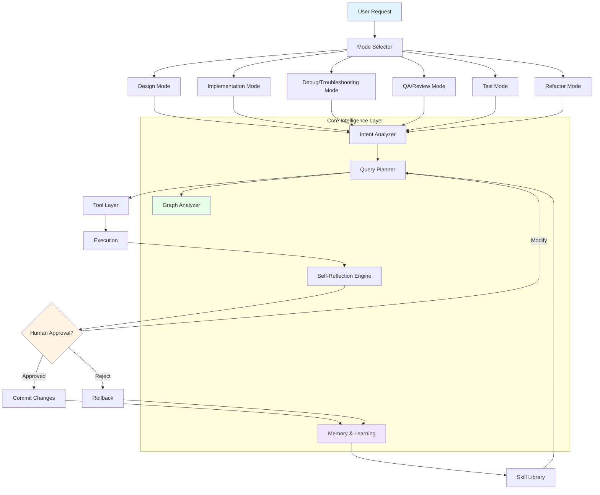
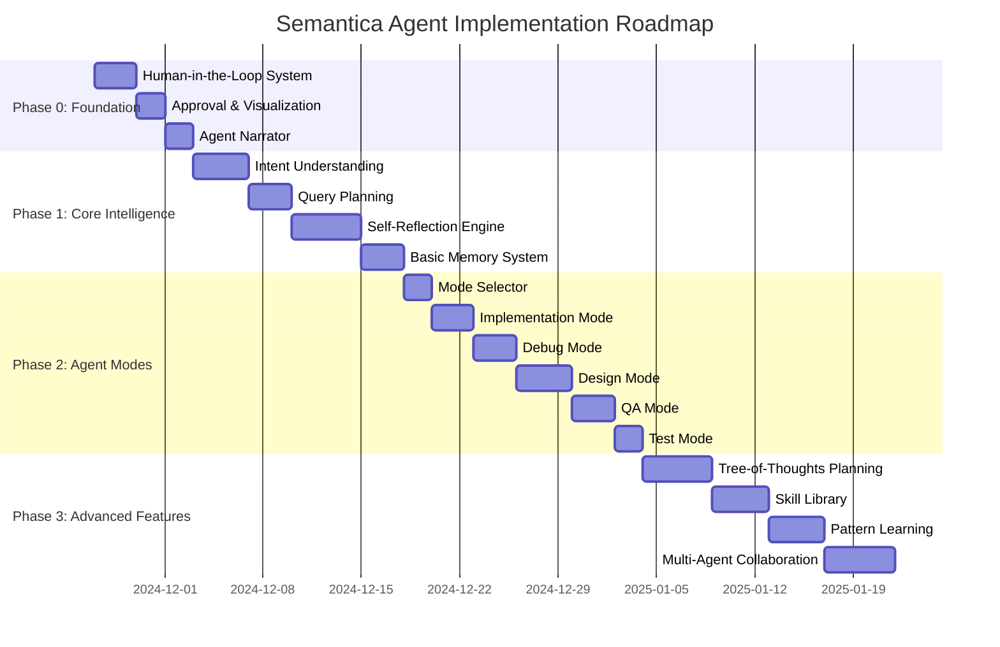
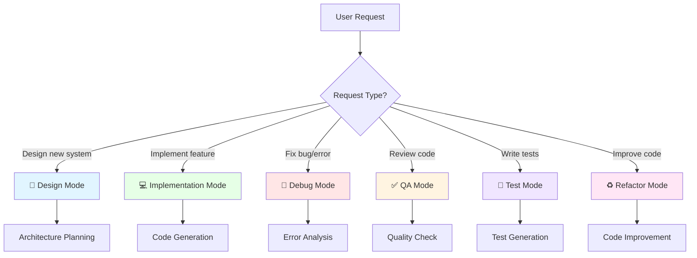
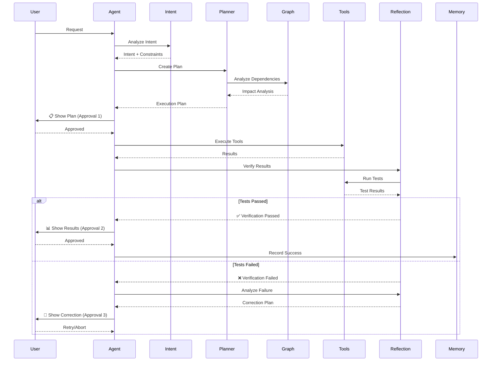
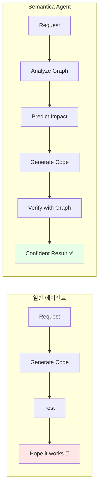

# Semantica Agent Architecture - SOTA Overview

**Date**: 2024-11-25
**Goal**: Cursor/Claude Code를 넘어서는 SOTA급 코딩 에이전트

---

## 🎯 핵심 설계 원칙

1. **Human-in-the-Loop First**: 신뢰와 제어권이 최우선
2. **Graph-Powered Intelligence**: Semantica의 코드 그래프를 모든 추론에 활용
3. **Multi-Mode Specialization**: 작업 유형별 전문화된 에이전트 모드
4. **Self-Improving**: 경험에서 배우고 개선
5. **Transparent & Explainable**: 모든 결정을 설명 가능

---

## 📐 전체 아키텍처

---

## 🚀 구현 로드맵 (Phase별)

---

## 🎭 Agent Modes (작업별 전문화)

### Mode 선택 기준

각 모드별 상세 내용은 [01.Agent_Modes.md](01.Agent_Modes.md) 참조

---

## 🔄 Execution Flow (모든 모드 공통)

---

## 🧠 Core Intelligence Components

### 1. Intent Understanding
- **입력**: Natural language request
- **출력**: Structured Intent + Constraints + Success Criteria
- **기법**: Multi-level classification + Entity extraction

### 2. Query Planning
- **입력**: Intent + Available Tools
- **출력**: Execution Plan (DAG of tool calls)
- **기법**: Graph-aware planning + Cost optimization

### 3. Graph Analysis (Semantica 차별화)
- **입력**: Proposed changes
- **출력**: Impact Analysis + Dependency Graph
- **기법**: Call graph + Dependency graph + Symbol resolution

### 4. Self-Reflection
- **입력**: Execution results + Original intent
- **출력**: Verification Result + Correction Plan
- **기법**: Multi-level verification + Error analysis

### 5. Memory & Learning
- **입력**: Successful/Failed episodes
- **출력**: Learned skills + Patterns
- **기법**: Episodic memory + Skill extraction

---

## 🎯 Semantica만의 차별화 포인트

### 1. **Graph-Powered Everything**

**예시**:
- 일반: "User.py 수정했어요"
- **Semantica**: "User.py 수정 → UserService(5개 함수), UserHandler(3개 엔드포인트)에 영향. 테스트 12개 실행 필요 [그래프 시각화]"

### 2. **Symbol-Level Precision**
- 파일 레벨이 아닌 **심볼 레벨** 분석/수정
- "이 클래스의 모든 메서드에 logging 추가" 같은 정밀 작업

### 3. **Historical Pattern Learning**
- 과거 성공/실패 패턴 학습
- "지난번 비슷한 리팩토링에서 이 방법이 효과적이었음"

### 4. **Dependency-Aware Execution**
- 이미 구현된 `DependencyAwareOrdering` 활용
- "파일 A → B → C 순서로 수정해야 안전함"

---

## 📊 Success Metrics

### 사용자 경험 지표
- **Task Success Rate**: 95%+ (첫 시도 성공률)
- **Approval Rate**: 사용자가 제안 승인하는 비율 >90%
- **Rollback Rate**: <5% (잘못된 수정으로 인한 롤백)

### 성능 지표
- **Response Time**: Plan 생성 <5초, 실행 <30초
- **Confidence Accuracy**: Confidence 90% 예측 → 실제 성공률 >85%
- **Test Coverage**: 수정한 코드의 테스트 커버리지 >80%

### 학습 지표
- **Skill Library Growth**: 주당 3-5개 새로운 패턴 학습
- **Pattern Reuse**: 학습한 스킬 재사용률 >50%
- **Error Reduction**: 유사 작업 반복 시 에러율 감소 추세

---

## 🚧 Implementation Status

### ✅ 완료
- Retriever SOTA Enhancements (Late Interaction Cache, LLM Reranker Cache, etc.)
- Dependency-aware Ordering
- Contextual Query Expansion
- Basic Tool Layer

### 🚧 진행 중
- Human-in-the-Loop System (Phase 0)
- Intent Understanding (Phase 1)

### 📋 예정
- Agent Modes (Phase 2)
- Advanced Planning (Phase 3)
- Memory & Learning (Phase 3)

---

## 📚 관련 문서

1. [01.Agent_Modes.md](01.Agent_Modes.md) - 모드별 상세 설계
2. [02.Human_in_the_Loop.md](02.Human_in_the_Loop.md) - 승인 시스템
3. [03.Self_Reflection.md](03.Self_Reflection.md) - 자기 검증
4. [04.Memory_Learning.md](04.Memory_Learning.md) - 학습 메커니즘
5. [05.Graph_Intelligence.md](05.Graph_Intelligence.md) - 그래프 활용

---

**작성자**: Claude Code + Human Collaboration
**최종 수정**: 2024-11-25
