```mermaid
flowchart TD
    Start[Code to Review] --> Understand[Understand Code Intent]

    Understand --> MultiLevel[Multi-Level Analysis]

    MultiLevel --> Syntax[Level 1: Syntax & Style]
    MultiLevel --> Logic[Level 2: Logic & Correctness]
    MultiLevel --> Design[Level 3: Design & Architecture]
    MultiLevel --> Security[Level 4: Security]
    MultiLevel --> Performance[Level 5: Performance]

    Syntax --> Lint[run_lint]
    Syntax --> Format[Check Formatting]
    Syntax --> Naming[Check Naming Conventions]

    Logic --> Tests[Are There Tests?]
    Logic --> Coverage[Test Coverage]
    Logic --> EdgeCases[Edge Case Handling]
    Logic --> ErrorHandling[Error Handling]

    Design --> Complexity[analyze_complexity]
    Design --> CodeSmells[detect_code_smells]
    Design --> Patterns[Check Design Patterns]
    Design --> SOLID[SOLID Principles]

    Security --> Injection[SQL/Command Injection]
    Security --> Auth[Authentication Issues]
    Security --> Sensitive[Sensitive Data Exposure]
    Security --> Dependencies[Vulnerable Dependencies]

    Performance --> BigO[Algorithm Complexity]
    Performance --> MemoryLeaks[Memory Leaks]
    Performance --> N+1[N+1 Query Problems]
    Performance --> Caching[Caching Opportunities]

    Lint --> Aggregate[Aggregate Findings]
    Format --> Aggregate
    Naming --> Aggregate
    Tests --> Aggregate
    Coverage --> Aggregate
    EdgeCases --> Aggregate
    ErrorHandling --> Aggregate
    Complexity --> Aggregate
    CodeSmells --> Aggregate
    Patterns --> Aggregate
    SOLID --> Aggregate
    Injection --> Aggregate
    Auth --> Aggregate
    Sensitive --> Aggregate
    Dependencies --> Aggregate
    BigO --> Aggregate
    MemoryLeaks --> Aggregate
    N+1 --> Aggregate
    Caching --> Aggregate

    Aggregate --> Categorize[Categorize Issues]
    Categorize --> Critical[🔴 Critical]
    Categorize --> High[🟠 High]
    Categorize --> Medium[🟡 Medium]
    Categorize --> Low[🟢 Low/Suggestion]

    Critical --> Report[Generate Report]
    High --> Report
    Medium --> Report
    Low --> Report

    Report --> Suggestions[Generate Fix Suggestions]
    Suggestions --> AutoFix{Auto-Fixable?}

    AutoFix -->|Yes| ProposeFix[propose_patch]
    AutoFix -->|No| ManualGuide[Manual Fix Guide]

    ProposeFix --> Review[Human Review]
    ManualGuide --> Review

    Review --> Approval{Approve Fix?}
    Approval -->|Yes| Apply[apply_patch]
    Approval -->|No| End[End]

    Apply --> Verify[Verify Fix]
    Verify --> Success[Success]

    style Critical fill:#ffe6e6
    style High fill:#fff4e1
    style Medium fill:#ffffcc
    style Low fill:#e6ffe6
    style Approval fill:#fff4e1
```

# Agent Modes - SOTA Design

**Date**: 2024-11-25
**Purpose**: 작업 유형별 전문화된 에이전트 모드 설계

---

## 🎯 Overview

코딩 작업은 성격에 따라 완전히 다른 접근법이 필요합니다. Semantica Agent는 **6가지 전문 모드**를 제공하여 각 작업에 최적화된 워크플로우를 제공합니다.


---

## 1. 🎨 Design Mode (설계 모드)

### 목적
시스템 아키텍처, API 설계, 데이터 모델 설계 등 **구현 전 설계 단계**

### 적용 시점
- "새로운 인증 시스템 설계해줘"
- "마이크로서비스 아키텍처로 리팩토링 계획 세워줘"
- "GraphQL API 설계해줘"

### Workflow


### Key Features

#### 1. **Multiple Design Options** (SOTA: AlphaCode approach)
```python
class DesignModeAgent:
    async def design(self, request: str) -> DesignResult:
        # Generate 3 different design approaches
        options = await self.generate_design_options(request, count=3)

        # Evaluate each option
        evaluations = []
        for option in options:
            eval_result = await self.evaluate_design(option)
            evaluations.append(eval_result)

        # Rank by composite score
        ranked = self.rank_designs(evaluations)

        return DesignResult(
            recommended=ranked[0],
            alternatives=ranked[1:],
            comparison=self.create_comparison_table(evaluations)
        )
```

#### 2. **Graph-Based Architecture Analysis** (Semantica 차별화)
```python
class ArchitectureAnalyzer:
    async def analyze_current_architecture(self, scope: str) -> ArchAnalysis:
        """
        Analyze existing architecture using code graph
        """

        # Get all components in scope
        components = await self.graph.get_nodes_by_scope(scope)

        # Analyze dependencies
        dep_graph = await self.graph.build_dependency_subgraph(components)

        # Detect patterns
        patterns = self.detect_architectural_patterns(dep_graph)

        # Identify anti-patterns
        anti_patterns = self.detect_anti_patterns(dep_graph)

        # Calculate metrics
        metrics = self.calculate_architecture_metrics(dep_graph)

        return ArchAnalysis(
            components=components,
            dependency_graph=dep_graph,
            patterns=patterns,
            anti_patterns=anti_patterns,
            metrics=metrics,
            recommendations=self.generate_recommendations(anti_patterns)
        )
```

#### 3. **ADR (Architecture Decision Record) Generation**
```python
class ADRGenerator:
    def generate_adr(self, design: DesignOption, context: Context) -> ADR:
        """
        Generate Architecture Decision Record

        Format: https://adr.github.io/
        """

        return ADR(
            title=f"ADR-{self.next_number()}: {design.title}",
            status="Proposed",
            context=self.format_context(context),
            decision=design.description,
            consequences=design.consequences,
            alternatives=design.alternatives_considered,
            rationale=design.rationale
        )
```

### Tool Usage Strategy
```python
DESIGN_MODE_TOOLS = [
    "code_search",           # Find similar implementations
    "symbol_search",         # Find related components
    "get_dependencies",      # Understand current dependencies
    "get_inheritance_tree",  # Understand class hierarchies
    "analyze_complexity",    # Assess current complexity
    "summarize_file",        # Understand existing modules
]
```

### Best Practices

1. **Always provide 3+ design options** (학술 검증: Diversity in solution space)
2. **Use existing codebase patterns** (Consistency > Innovation)
3. **Graph-based impact prediction** (Semantica strength)
4. **Generate visual diagrams** (Mermaid/PlantUML)
5. **Create ADR for major decisions** (Industry standard)

---

## 2. 💻 Implementation Mode (기능 구현 모드)

### 목적
새로운 기능 개발, 코드 작성, 통합

### 적용 시점
- "사용자 인증 기능 구현해줘"
- "GraphQL API 엔드포인트 추가해줘"
- "결제 모듈 통합해줘"

### Workflow


### Key Features

#### 1. **Incremental Development with Validation**
```python
class IncrementalImplementation:
    async def implement(self, feature: Feature) -> Result:
        """
        Implement feature incrementally with validation at each step
        """

        steps = self.break_into_steps(feature)

        for i, step in enumerate(steps):
            logger.info(f"Step {i+1}/{len(steps)}: {step.description}")

            # Implement this step
            patch = await self.generate_patch(step)

            # Apply patch
            await self.apply_patch(patch)

            # Immediate validation
            validation = await self.validate_step(step)

            if not validation.success:
                # Rollback and try alternative
                await self.rollback_step()
                alternative = await self.generate_alternative(step, validation.error)
                await self.apply_patch(alternative)

            # Checkpoint (for potential rollback)
            await self.create_checkpoint(f"Step {i+1} complete")

        return Result(success=True, steps_completed=len(steps))
```

#### 2. **Pattern-Based Code Generation** (SOTA: Skill Library)
```python
class PatternBasedCodeGen:
    async def generate_code(self, intent: Intent) -> Code:
        """
        Generate code using learned patterns
        """

        # Find similar past implementations
        similar = await self.memory.find_similar_implementations(intent)

        if similar:
            # Extract successful pattern
            pattern = self.extract_pattern(similar[0])

            # Adapt pattern to current context
            adapted = self.adapt_pattern(pattern, intent)

            logger.info(f"Using pattern from {similar[0].file_path}")
            return adapted

        # No pattern found - generate from scratch
        return await self.generate_from_scratch(intent)
```

#### 3. **Graph-Guided Integration** (Semantica 차별화)
```python
class GraphGuidedIntegration:
    async def integrate_new_component(
        self,
        component: Component,
        integration_points: list[str]
    ) -> IntegrationPlan:
        """
        Use graph to find safe integration points
        """

        # Analyze existing graph
        existing_graph = await self.graph.get_subgraph(integration_points)

        # Find integration points with minimal disruption
        candidates = self.find_integration_candidates(existing_graph, component)

        # Score by:
        # - Coupling (lower is better)
        # - Cohesion (higher is better)
        # - Test coverage (higher is better)
        scored = self.score_integration_points(candidates)

        best = scored[0]

        return IntegrationPlan(
            target_symbol=best.symbol,
            integration_type=best.type,  # inheritance, composition, dependency injection
            required_changes=best.changes,
            test_strategy=best.test_strategy
        )
```

### Tool Usage Strategy
```python
IMPLEMENTATION_MODE_TOOLS = [
    # Discovery
    "code_search",
    "search_similar_code",
    "symbol_search",

    # Analysis
    "get_symbol_definition",
    "get_type_info",
    "get_dependencies",

    # Implementation
    "propose_patch",
    "apply_patch",
    "create_file",

    # Validation
    "check_syntax",
    "type_check",
    "run_tests",
    "run_lint",
]
```

### Best Practices

1. **TDD when possible** (학술 검증: Test-first development reduces defects)
2. **Small, verifiable steps** (Incremental > Big-bang)
3. **Pattern reuse** (DRY principle)
4. **Immediate validation** (Fail fast)
5. **Graph-aware integration** (Semantica strength)

---

## 3. 🐛 Debug/Troubleshooting Mode

### 목적
버그 수정, 에러 해결, 성능 문제 진단

### 적용 시점
- "이 에러 수정해줘"
- "왜 테스트가 실패하는지 찾아줘"
- "성능 문제 원인 파악해줘"

### Workflow


### Key Features

#### 1. **Graph-Based Root Cause Analysis** (Semantica 차별화)
```python
class GraphBasedDebugger:
    async def find_root_cause(self, error: ErrorReport) -> RootCause:
        """
        Use call graph to trace error to source
        """

        # Get error location
        error_symbol = await self.graph.find_symbol_at_location(
            file=error.file,
            line=error.line
        )

        # Backward trace: Who calls this?
        callers = await self.graph.get_callers(error_symbol, depth=5)

        # Forward trace: What does this call?
        callees = await self.graph.get_callees(error_symbol, depth=3)

        # Data flow analysis
        data_flow = await self.graph.trace_data_flow(error_symbol)

        # Find suspicious patterns
        suspects = []

        # Check for null pointer
        if "NullPointerException" in error.message:
            suspects.extend(self.find_uninitialized_vars(data_flow))

        # Check for type mismatch
        if "TypeError" in error.message:
            suspects.extend(self.find_type_mismatches(callees))

        # Check for logic errors
        suspects.extend(self.find_logic_errors(error_symbol, data_flow))

        # Rank suspects by likelihood
        ranked = self.rank_suspects(suspects, error)

        return RootCause(
            most_likely=ranked[0],
            alternatives=ranked[1:3],
            analysis=self.explain_root_cause(ranked[0], error)
        )
```

#### 2. **Hypothesis-Driven Debugging** (SOTA: Scientific method)
```python
class HypothesisDebugger:
    async def debug(self, error: ErrorReport) -> DebugResult:
        """
        Generate and test hypotheses scientifically
        """

        # Generate hypotheses
        hypotheses = await self.generate_hypotheses(error)

        for hypothesis in hypotheses:
            logger.info(f"Testing hypothesis: {hypothesis.description}")

            # Design experiment to test hypothesis
            experiment = self.design_experiment(hypothesis)

            # Run experiment
            result = await self.run_experiment(experiment)

            if result.confirms_hypothesis:
                # Found root cause!
                return DebugResult(
                    root_cause=hypothesis.root_cause,
                    confidence=result.confidence,
                    evidence=result.evidence
                )

        # No hypothesis confirmed - need more information
        return DebugResult(
            status="need_more_info",
            suggestions=self.suggest_next_steps(hypotheses)
        )
```

#### 3. **Automatic Reproduction Test Generation**
```python
class ReproductionTestGenerator:
    async def generate_reproduction_test(self, error: ErrorReport) -> Test:
        """
        Generate test that reproduces the bug
        """

        # Extract context from error
        context = self.extract_context(error)

        # Generate test that should fail
        test_code = f"""
def test_reproduction_{error.id}():
    '''
    Reproduces bug: {error.message}

    Error location: {error.file}:{error.line}
    Stack trace:
    {error.stack_trace}
    '''
    # Setup
    {self.generate_setup(context)}

    # Trigger bug
    with pytest.raises({error.exception_type}):
        {self.generate_trigger(context)}

    # This test should pass after fix
"""

        return Test(
            name=f"test_reproduction_{error.id}",
            code=test_code,
            expected_behavior="Should pass after fix"
        )
```

### Tool Usage Strategy
```python
DEBUG_MODE_TOOLS = [
    # Error analysis
    "explain_error",
    "git_blame",           # Who last changed this?
    "git_log",             # Recent changes

    # Graph analysis
    "get_callers",
    "get_callees",
    "get_dependencies",
    "find_usages",

    # Investigation
    "open_file",
    "get_symbol_definition",
    "get_type_info",

    # Testing
    "run_single_test",
    "check_syntax",
    "type_check",
]
```

### Best Practices

1. **Scientific method** (Hypothesis → Experiment → Conclusion)
2. **Graph-based tracing** (Semantica strength)
3. **Minimal fix** (Change as little as possible)
4. **Reproduction test first** (Ensure bug is actually fixed)
5. **Learn from incidents** (Update pattern library)

---

## 4. ✅ QA/Review Mode

### 목적
코드 리뷰, 품질 검사, 보안 감사

### 적용 시점
- "이 코드 리뷰해줘"
- "보안 취약점 찾아줘"
- "코드 품질 개선점 알려줘"

### Workflow



### Key Features

#### 1. **Multi-Level Review** (Industry best practice)
```python
class MultiLevelReviewer:
    async def review(self, code: CodeSubmission) -> ReviewResult:
        """
        Review code at multiple levels
        """

        findings = []

        # Level 1: Syntax & Style (fast)
        syntax_issues = await self.review_syntax(code)
        findings.extend(syntax_issues)

        # Level 2: Logic & Correctness
        logic_issues = await self.review_logic(code)
        findings.extend(logic_issues)

        # Level 3: Design & Architecture
        design_issues = await self.review_design(code)
        findings.extend(design_issues)

        # Level 4: Security (critical)
        security_issues = await self.review_security(code)
        findings.extend(security_issues)

        # Level 5: Performance
        perf_issues = await self.review_performance(code)
        findings.extend(perf_issues)

        # Categorize by severity
        categorized = self.categorize_findings(findings)

        return ReviewResult(
            total_issues=len(findings),
            by_severity=categorized,
            auto_fixable=self.count_auto_fixable(findings),
            report=self.generate_report(categorized)
        )
```

#### 2. **Graph-Based Architecture Review** (Semantica 차별화)
```python
class ArchitectureReviewer:
    async def review_architecture(self, changes: list[Change]) -> ArchReview:
        """
        Review architectural impact of changes
        """

        issues = []

        # Check for circular dependencies
        for change in changes:
            affected = await self.graph.get_affected_components(change)
            cycles = await self.graph.find_cycles(affected)

            if cycles:
                issues.append(Issue(
                    severity="HIGH",
                    category="circular_dependency",
                    description=f"Creates circular dependency: {' → '.join(cycles[0])}",
                    location=change.file_path
                ))

        # Check for God Object
        for change in changes:
            symbol = await self.graph.get_symbol(change.symbol_id)
            complexity = await self.analyze_complexity(symbol)

            if complexity.methods > 20 or complexity.lines > 500:
                issues.append(Issue(
                    severity="MEDIUM",
                    category="god_object",
                    description=f"{symbol.name} is too large (God Object anti-pattern)",
                    suggestion="Consider splitting into smaller classes"
                ))

        # Check for tight coupling
        coupling = await self.measure_coupling(changes)
        if coupling > 0.7:
            issues.append(Issue(
                severity="MEDIUM",
                category="tight_coupling",
                description="High coupling detected",
                suggestion="Consider dependency injection or interfaces"
            ))

        return ArchReview(issues=issues)
```

#### 3. **Security-Focused Review** (SOTA: OWASP Top 10)
```python
class SecurityReviewer:
    SECURITY_PATTERNS = [
        # SQL Injection
        (r"execute\(['\"].*\+.*['\"]", "sql_injection"),

        # Command Injection
        (r"os\.system\(.*\+", "command_injection"),

        # Path Traversal
        (r"open\(.*user_input", "path_traversal"),

        # Hardcoded Secrets
        (r"password\s*=\s*['\"][^'\"]+['\"]", "hardcoded_secret"),
    ]

    async def review_security(self, code: str) -> list[SecurityIssue]:
        """
        Security-focused code review
        """

        issues = []

        # Pattern-based detection
        for pattern, issue_type in self.SECURITY_PATTERNS:
            matches = re.finditer(pattern, code, re.IGNORECASE)
            for match in matches:
                issues.append(SecurityIssue(
                    type=issue_type,
                    severity="CRITICAL",
                    location=match.span(),
                    suggestion=self.get_security_fix(issue_type)
                ))

        # Dependency vulnerability check
        deps = self.extract_dependencies(code)
        vulnerable = await self.check_vulnerabilities(deps)
        issues.extend(vulnerable)

        return issues
```

### Tool Usage Strategy
```python
QA_MODE_TOOLS = [
    # Static analysis
    "run_lint",
    "type_check",
    "analyze_complexity",
    "detect_code_smells",

    # Testing
    "run_tests",
    "check_syntax",

    # Graph analysis
    "get_dependencies",
    "get_callers",
    "get_callees",

    # History
    "git_blame",
    "git_log",
]
```

### Best Practices

1. **Multi-level review** (Syntax → Logic → Design → Security → Performance)
2. **Automated where possible** (Linters, type checkers)
3. **Security first** (OWASP Top 10)
4. **Graph-based architecture review** (Semantica strength)
5. **Auto-fix suggestions** (Not just complaints)

---

## 5. 🧪 Test Mode

### 목적
테스트 생성, 커버리지 향상, 테스트 전략 수립

### 적용 시점
- "이 함수에 대한 테스트 작성해줘"
- "커버리지 80%까지 올려줘"
- "엣지 케이스 테스트 추가해줘"

### Workflow


### Key Features

#### 1. **Intelligent Test Case Generation** (SOTA: Symbolic execution)
```python
class TestCaseGenerator:
    async def generate_test_cases(self, function: Function) -> list[TestCase]:
        """
        Generate comprehensive test cases
        """

        test_cases = []

        # 1. Happy path
        happy_case = self.generate_happy_path(function)
        test_cases.append(happy_case)

        # 2. Edge cases from type analysis
        edge_cases = await self.generate_edge_cases(function)
        test_cases.extend(edge_cases)

        # 3. Error cases
        error_cases = await self.generate_error_cases(function)
        test_cases.extend(error_cases)

        # 4. Boundary conditions
        boundary_cases = self.generate_boundary_cases(function)
        test_cases.extend(boundary_cases)

        # 5. Property-based tests (if applicable)
        if self.is_pure_function(function):
            property_tests = self.generate_property_tests(function)
            test_cases.extend(property_tests)

        return test_cases

    def generate_edge_cases(self, function: Function) -> list[TestCase]:
        """
        Generate edge cases based on parameter types
        """

        edge_cases = []

        for param in function.parameters:
            if param.type == "int":
                edge_cases.extend([
                    TestCase(name=f"test_{function.name}_zero", inputs={param.name: 0}),
                    TestCase(name=f"test_{function.name}_negative", inputs={param.name: -1}),
                    TestCase(name=f"test_{function.name}_max", inputs={param.name: sys.maxsize}),
                ])

            elif param.type == "str":
                edge_cases.extend([
                    TestCase(name=f"test_{function.name}_empty_string", inputs={param.name: ""}),
                    TestCase(name=f"test_{function.name}_special_chars", inputs={param.name: "!@#$%"}),
                    TestCase(name=f"test_{function.name}_unicode", inputs={param.name: "你好"}),
                ])

            elif param.type == "list":
                edge_cases.extend([
                    TestCase(name=f"test_{function.name}_empty_list", inputs={param.name: []}),
                    TestCase(name=f"test_{function.name}_single_item", inputs={param.name: [1]}),
                ])

        return edge_cases
```

#### 2. **Coverage-Guided Test Generation** (SOTA: Feedback-directed)
```python
class CoverageGuidedTestGen:
    async def improve_coverage(
        self,
        target_coverage: float = 0.8
    ) -> list[Test]:
        """
        Generate tests to improve coverage
        """

        generated_tests = []

        while True:
            # Run existing tests
            coverage = await self.run_with_coverage()

            if coverage.line_coverage >= target_coverage:
                break

            # Find uncovered paths
            uncovered = coverage.uncovered_lines

            # For each uncovered path
            for file, lines in uncovered.items():
                # Analyze control flow to reach these lines
                paths = await self.find_paths_to_lines(file, lines)

                # Generate test that reaches uncovered lines
                for path in paths:
                    test = await self.generate_test_for_path(path)
                    generated_tests.append(test)

                    # Apply and re-measure
                    await self.apply_test(test)
                    break

        return generated_tests
```

#### 3. **Mock Generation** (Semantica 차별화)
```python
class MockGenerator:
    async def generate_mocks(self, function: Function) -> dict[str, Mock]:
        """
        Generate mocks for function dependencies using graph
        """

        mocks = {}

        # Get dependencies from graph
        callees = await self.graph.get_callees(function.symbol_id)

        for callee in callees:
            if callee.is_external:
                # External dependency - need mock
                mock_code = self.create_mock(callee)
                mocks[callee.name] = mock_code

        return mocks

    def create_mock(self, callee: Symbol) -> str:
        """
        Create mock based on function signature
        """

        if callee.kind == "function":
            return f"""
@pytest.fixture
def mock_{callee.name}(mocker):
    mock = mocker.patch('{callee.fqn}')
    mock.return_value = {self.get_default_return_value(callee)}
    return mock
"""
```

### Tool Usage Strategy
```python
TEST_MODE_TOOLS = [
    # Code analysis
    "get_symbol_definition",
    "get_type_info",
    "get_callees",

    # Test execution
    "run_tests",
    "run_single_test",
    "check_syntax",

    # Coverage
    "analyze_complexity",  # To find complex paths
]
```

### Best Practices

1. **Comprehensive test cases** (Happy + Edge + Error + Boundary)
2. **Coverage-guided** (Target specific uncovered paths)
3. **Graph-based mock generation** (Semantica strength)
4. **Property-based testing** (for pure functions)
5. **Run tests immediately** (Verify generated tests work)

---

## 6. ♻️ Refactor Mode

### 목적
코드 개선, 리팩토링, 기술 부채 해결

### 적용 시점
- "이 코드 리팩토링해줘"
- "God Object 패턴 제거해줘"
- "중복 코드 제거해줘"

### Workflow


### Key Features

#### 1. **Catalog of Refactoring Patterns** (Industry standard: Martin Fowler)
```python
class RefactoringCatalog:
    PATTERNS = {
        "extract_method": ExtractMethodRefactoring,
        "extract_class": ExtractClassRefactoring,
        "move_method": MoveMethodRefactoring,
        "rename": RenameRefactoring,
        "replace_conditional_with_polymorphism": ReplaceConditionalRefactoring,
        "introduce_parameter_object": IntroduceParameterObjectRefactoring,
        "replace_inheritance_with_composition": ReplaceInheritanceRefactoring,
    }

    async def select_refactoring(self, code_smell: CodeSmell) -> Refactoring:
        """
        Select appropriate refactoring for code smell
        """

        if code_smell.type == "long_method":
            return self.PATTERNS["extract_method"](code_smell.location)

        elif code_smell.type == "large_class":
            return self.PATTERNS["extract_class"](code_smell.location)

        elif code_smell.type == "feature_envy":
            return self.PATTERNS["move_method"](code_smell.location)

        # ... more mappings
```

#### 2. **Test-Preserving Refactoring** (SOTA: Test-driven refactoring)
```python
class SafeRefactoring:
    async def refactor(self, target: Symbol, pattern: Refactoring) -> Result:
        """
        Refactor while ensuring tests still pass
        """

        # 1. Run tests before
        before_tests = await self.run_tests()
        if not before_tests.all_passed:
            return Result(error="Tests must pass before refactoring")

        # 2. Create checkpoint
        checkpoint = await self.create_checkpoint()

        # 3. Apply refactoring
        try:
            await pattern.apply(target)
        except Exception as e:
            await self.rollback_to_checkpoint(checkpoint)
            return Result(error=str(e))

        # 4. Run tests after
        after_tests = await self.run_tests()

        # 5. Compare
        if after_tests.all_passed:
            return Result(success=True)
        else:
            # Rollback if tests fail
            await self.rollback_to_checkpoint(checkpoint)
            return Result(error="Refactoring broke tests", failed_tests=after_tests.failed)
```

#### 3. **Metrics-Driven Refactoring** (Quantitative validation)
```python
class MetricsDrivenRefactoring:
    async def validate_refactoring(
        self,
        before: Code,
        after: Code
    ) -> ValidationResult:
        """
        Validate that refactoring improved metrics
        """

        before_metrics = await self.calculate_metrics(before)
        after_metrics = await self.calculate_metrics(after)

        improvements = {
            "complexity": (before_metrics.complexity - after_metrics.complexity) / before_metrics.complexity,
            "coupling": (before_metrics.coupling - after_metrics.coupling) / before_metrics.coupling,
            "duplication": (before_metrics.duplication - after_metrics.duplication) / before_metrics.duplication,
        }

        # All metrics should improve or stay same
        if all(imp >= 0 for imp in improvements.values()):
            return ValidationResult(
                success=True,
                improvements=improvements,
                recommendation="Accept refactoring"
            )
        else:
            return ValidationResult(
                success=False,
                improvements=improvements,
                recommendation="Reject refactoring - metrics worsened"
            )
```

### Tool Usage Strategy
```python
REFACTOR_MODE_TOOLS = [
    # Analysis
    "analyze_complexity",
    "detect_code_smells",
    "search_similar_code",  # Find duplication
    "get_dependencies",     # Coupling analysis

    # Refactoring
    "propose_patch",
    "rename_symbol",        # Safe rename

    # Validation
    "run_tests",
    "type_check",
    "run_lint",
]
```

### Best Practices

1. **Tests must pass before refactoring** (Safety first)
2. **Small, incremental changes** (Not big-bang refactoring)
3. **Metrics validation** (Quantify improvement)
4. **Catalog-based** (Use proven patterns)
5. **Test-preserving** (Tests must pass after)

---

## 🎯 Mode Selection Logic

```python
class ModeSelector:
    async def select_mode(self, user_request: str, context: Context) -> AgentMode:
        """
        Automatically select appropriate mode
        """

        # Keywords mapping
        mode_keywords = {
            AgentMode.DESIGN: ["design", "architecture", "plan", "structure"],
            AgentMode.IMPLEMENT: ["implement", "add", "create", "build"],
            AgentMode.DEBUG: ["fix", "bug", "error", "crash", "not working"],
            AgentMode.QA: ["review", "check", "audit", "quality"],
            AgentMode.TEST: ["test", "coverage", "verify"],
            AgentMode.REFACTOR: ["refactor", "improve", "clean up", "simplify"],
        }

        # Score each mode
        scores = {}
        for mode, keywords in mode_keywords.items():
            score = sum(1 for kw in keywords if kw in user_request.lower())
            scores[mode] = score

        # Additional context-based scoring
        if context.has_failing_tests:
            scores[AgentMode.DEBUG] += 3

        if context.recent_changes:
            scores[AgentMode.QA] += 1

        if context.complexity_high:
            scores[AgentMode.REFACTOR] += 2

        # Select highest score
        best_mode = max(scores.items(), key=lambda x: x[1])[0]

        # Ask user to confirm if ambiguous
        if scores[best_mode] < 2:
            best_mode = await self.ask_user_for_mode(user_request, scores)

        return best_mode
```

---

## 📚 참고 문헌 (학술/산업 검증)

### Design Mode
- **Architecture Decision Records (ADR)**: https://adr.github.io/
- **AlphaCode (DeepMind)**: Multiple solution generation
- **Design Patterns (Gang of Four)**: Proven solutions catalog

### Implementation Mode
- **TDD (Kent Beck)**: Test-Driven Development
- **Incremental Development**: Agile best practices
- **Pattern Libraries**: Code reuse strategies

### Debug Mode
- **Scientific Debugging (Andreas Zeller)**: "Why Programs Fail"
- **Delta Debugging**: Automated root cause isolation
- **Fault Localization**: Spectrum-based approaches

### QA Mode
- **OWASP Top 10**: Security vulnerability catalog
- **Static Analysis**: PMD, SonarQube best practices
- **Code Review Best Practices (Google)**: Engineering at Google

### Test Mode
- **Symbolic Execution**: Automatic test generation
- **Property-Based Testing (QuickCheck)**: Generative testing
- **Coverage-Guided Fuzzing (AFL)**: Feedback-directed test gen

### Refactor Mode
- **Refactoring (Martin Fowler)**: Catalog of refactoring patterns
- **Code Smells**: Bad code patterns taxonomy
- **Metrics-Driven Development**: Quantitative validation

---

**작성자**: Claude Code + Human Collaboration
**최종 수정**: 2024-11-25
