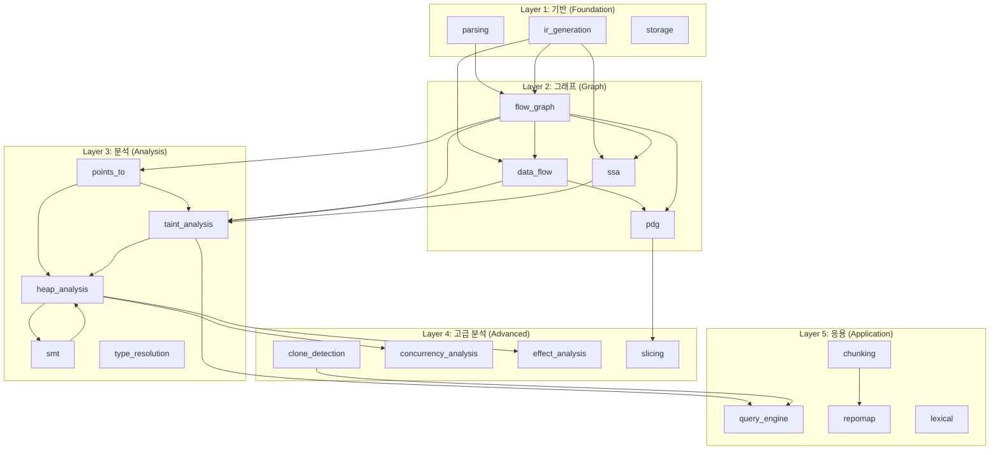

# Codegraph Features 의존성 맵 & 알고리즘 기반

## 📊 의존성 그래프 (Mermaid)



---

## 🔬 모듈별 의존성 상세

### Layer 1: Foundation (기반)

| 모듈 | 의존 | 역할 |
|------|------|------|
| `parsing` | - | Tree-sitter 파싱 |
| `ir_generation` | parsing, cache, flow_graph, ssa | IR 노드/엣지 생성 |
| `storage` | - | 영속 저장소 (SQLite/Postgres) |

### Layer 2: Graph (그래프 구조)

| 모듈 | 의존 | 역할 |
|------|------|------|
| `flow_graph` | parsing, ir_generation | CFG/BFG 생성 |
| `data_flow` | flow_graph, ir_generation | DFG 생성 |
| `ssa` | flow_graph, data_flow, ir_generation | SSA 변환 |
| `pdg` | data_flow, flow_graph | PDG (Program Dependence Graph) |

### Layer 3: Analysis (핵심 분석)

| 모듈 | 의존 | 역할 |
|------|------|------|
| `points_to` | flow_graph, heap_analysis | Alias Analysis |
| `taint_analysis` | data_flow, flow_graph, ssa, points_to, heap_analysis, smt | 오염 분석 |
| `heap_analysis` | points_to, smt, taint_analysis | 메모리 안전성 |
| `smt` | heap_analysis | 기호 실행 |
| `type_resolution` | ir_generation | 타입 추론 |

### Layer 4: Advanced (고급 분석)

| 모듈 | 의존 | 역할 |
|------|------|------|
| `clone_detection` | - | 코드 클론 탐지 |
| `concurrency_analysis` | cross_file, heap_analysis | Race/Deadlock |
| `effect_analysis` | cross_file, heap_analysis | Side Effect |
| `slicing` | pdg | Program Slicing |

### Layer 5: Application (응용)

| 모듈 | 의존 | 역할 |
|------|------|------|
| `query_engine` | taint_analysis, clone_detection, ir_generation | 쿼리 실행 |
| `repomap` | chunking | 저장소 맵 |
| `lexical` | storage, multi_index, query_engine | 텍스트 검색 |
| `chunking` | - | 코드 청킹 |

---

## 🧠 알고리즘 & 방법론 기반

### Points-To Analysis (Alias)

| 알고리즘 | 복잡도 | 파일 | 출처 |
|----------|--------|------|------|
| **Steensgaard** | O(n·α(n)) | `steensgaard_solver.rs` | POPL 1996 |
| **Andersen** | O(n³) | `andersen_solver.rs` | PhD 1994 |
| **Wave Propagation** | O(n²) | `wave_propagation.rs` | - |
| **Demand-Driven** | O(query) | `demand_driven.rs` | - |
| **Flow-Sensitive** | O(n²·k) | `flow_sensitive_solver.rs` | - |
| **Incremental** | O(Δ) | `incremental_pta.rs` | - |
| **Parallel Andersen** | O(n³/p) | `parallel_andersen.rs` | - |

### Taint Analysis

| 알고리즘 | 복잡도 | 파일 | 출처 |
|----------|--------|------|------|
| **IFDS** | O(E·D³) | `ifds_framework.rs`, `ifds_solver.rs` | Reps et al. 1995 |
| **IDE** | O(E·D³) | `ide_framework.rs`, `ide_solver.rs` | Sagiv et al. 1996 |
| **Sparse IFDS** | O(E·D²) | `sparse_ifds.rs` | Oh et al. 2014 |
| **Backward** | O(E·D³) | `backward_taint.rs` | - |
| **Path-Sensitive** | O(2^n) | `path_sensitive.rs` | - |
| **Differential** | O(Δ) | `differential/` | - |

### Concurrency Analysis

| 알고리즘 | 복잡도 | 파일 | 출처 |
|----------|--------|------|------|
| **RacerD** | O(n²) | `async_race_detector.rs` | Facebook Infer 2018 |
| **Tarjan SCC** | O(V+E) | `deadlock_detector.rs` | Tarjan 1972 |
| **Lamport Clocks** | O(n) | `happens_before.rs` | Lamport 1978 |

### Clone Detection

| 알고리즘 | 복잡도 | 파일 | 출처 |
|----------|--------|------|------|
| **Type-1 (Exact)** | O(n) | `type1_detector.rs` | - |
| **Type-2 (Renamed)** | O(n log n) | `type2_detector.rs` | - |
| **Type-3 (Gapped)** | O(n²) | `type3_detector.rs` | - |
| **Type-4 (Semantic)** | O(n²) | `type4_detector.rs` | - |
| **LSH Index** | O(n) | `lsh/` | Indyk & Motwani 1998 |

### Type System

| 알고리즘 | 복잡도 | 파일 | 출처 |
|----------|--------|------|------|
| **Hindley-Milner** | O(n) | `constraint_solver.rs` | Milner 1978 |
| **Liquid Types** | O(n·SMT) | `refinement_types.rs` | Rondon 2008 |
| **Dependent Types** | O(n) | `dependent_types.rs` | Xi & Pfenning 1999 |

### SMT / Symbolic

| 알고리즘 | 복잡도 | 파일 | 출처 |
|----------|--------|------|------|
| **Concolic** | O(2^n) | `concolic.rs` | DART 2005 |
| **Interval** | O(n) | `interval_tracker.rs` | Cousot 1977 |
| **String Theory** | O(n·SMT) | `string_constraint_solver.rs` | - |

### Graph Algorithms

| 알고리즘 | 복잡도 | 사용처 | 출처 |
|----------|--------|--------|------|
| **PageRank** | O(k·E) | `repomap` | Page & Brin 1998 |
| **Tarjan SCC** | O(V+E) | `points_to`, `concurrency` | Tarjan 1972 |
| **Fixpoint** | O(k·n) | `taint`, `points_to` | - |
| **Worklist** | O(E) | `taint_analysis` | - |

---

## 📈 의존성 레이어 요약

```
┌─────────────────────────────────────────────────────────────┐
│                    Layer 5: Application                      │
│  query_engine ← repomap ← lexical ← chunking                │
├─────────────────────────────────────────────────────────────┤
│                    Layer 4: Advanced                         │
│  slicing ← clone_detection ← concurrency ← effect_analysis │
├─────────────────────────────────────────────────────────────┤
│                    Layer 3: Analysis                         │
│  points_to ↔ taint_analysis ↔ heap_analysis ↔ smt          │
│                    type_resolution                           │
├─────────────────────────────────────────────────────────────┤
│                    Layer 2: Graph                            │
│           flow_graph → data_flow → ssa → pdg                │
├─────────────────────────────────────────────────────────────┤
│                    Layer 1: Foundation                       │
│              parsing → ir_generation → storage              │
└─────────────────────────────────────────────────────────────┘
```

---

## 🔗 핵심 의존 경로

1. **Taint 분석 경로**:
   ```
   parsing → ir_generation → flow_graph → data_flow → ssa → taint_analysis
                                                          ↓
                                              points_to → heap_analysis
   ```

2. **메모리 안전성 경로**:
   ```
   parsing → ir_generation → flow_graph → points_to → heap_analysis → smt
   ```

3. **코드 검색 경로**:
   ```
   parsing → ir_generation → chunking → repomap → query_engine
                                ↓
                             lexical
   ```

4. **병렬성 분석 경로**:
   ```
   parsing → ir_generation → flow_graph → concurrency_analysis
                                              ↓
                                        heap_analysis
   ```
