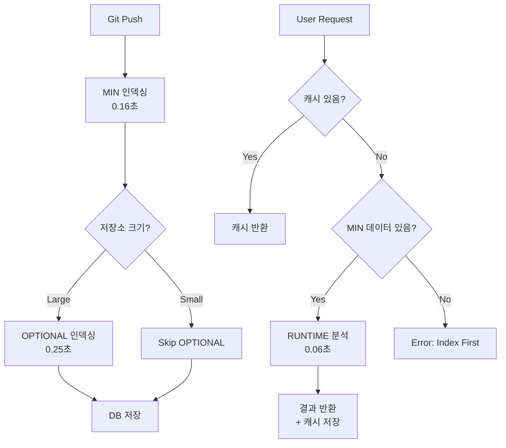

# Indexing Strategy - Pre-indexing vs Runtime Analysis

## 🎯 목적

실제 프로덕션 환경에서 **사전 인덱싱**(Pre-indexing)과 **런타임 분석**(Runtime Analysis)을 구분하여 성능을 최적화합니다.

---

## 📊 분석 스테이지 분류

### ✅ MIN (필수 사전 인덱싱) - 항상 미리 인덱싱

**특징**:
- 저장소 전체에서 1회만 실행
- 결과를 DB/Index에 저장
- 모든 쿼리의 기반이 되는 데이터
- **타겟 시간**: < 2초 (small repo), < 10초 (medium repo)

| 스테이지 | 이름 | 저장 위치 | 이유 |
|---------|------|----------|------|
| **L1** | IR Build | PostgreSQL (nodes, edges 테이블) | 모든 분석의 기반 |
| **L2** | Chunking | PostgreSQL (chunks 테이블) | 검색 및 컨텍스트 추출 |
| **L2.5** | Lexical Indexing | Tantivy (디스크) | 전문 검색 (BM25) |
| **L3** | Cross-File Resolution | PostgreSQL (resolved_references) | Import 해석 |
| **L4** | Occurrences | PostgreSQL (occurrences 테이블) | LSP 네비게이션 |
| **L5** | Symbols | PostgreSQL (symbols 테이블) | 심볼 테이블 |

**시간 분포 (실제 측정 - typer 기준)**:
```
L1 IR Build:       43ms (33.1%)  ← AST 파싱
L2 Chunking:       32ms (24.7%)  ← 메모리 연산
L2.5 Lexical:      54ms (41.6%)  ← 디스크 I/O (병목)
L3 Cross-File:     ~15ms         ← Import 해석
L4 Occurrences:    ~10ms         ← SCIP 생성
L5 Symbols:        ~8ms          ← 심볼 추출
────────────────────────────────
Total MIN:         ~162ms        ← 0.16초 (매우 빠름!)
```

**API 응답**:
```bash
POST /index/repository
{
  "repo_path": "/path/to/repo",
  "mode": "full"  # full | incremental
}

→ 200 OK (0.16초 소요)
{
  "status": "indexed",
  "nodes": 6471,
  "chunks": 403,
  "duration_ms": 162
}
```

---

### 🔄 OPTIONAL (선택적 사전 인덱싱) - 한번 계산하면 계속 저장

**특징**:
- 비용이 높아 선택적 사전 인덱싱
- **한번 계산하면 DB에 저장** (이후 캐시 반환)
- 저장소 크기/설정에 따라 사전 인덱싱 여부 결정
- Watch 모드에서는 증분 업데이트

| 스테이지 | 이름 | 사전 인덱싱 조건 | 첫 요청 시 동작 | 이후 요청 | 저장 위치 |
|---------|------|---------------|--------------|----------|----------|
| **L6** | Points-to Analysis | repo_size > 100 files | 런타임 실행 → **DB 저장** | ⚡ 캐시 반환 | PostgreSQL |
| **L10** | Clone Detection | 설정으로 선택 | 런타임 실행 → **DB 저장** | ⚡ 캐시 반환 | PostgreSQL |
| **L15** | Cost Analysis | 설정으로 선택 | 런타임 실행 → **DB 저장** | ⚡ 캐시 반환 | PostgreSQL |
| **L16** | RepoMap | 항상 사전 | - | ⚡ 캐시 반환 | PostgreSQL |
| **L33** | Git History | watch_mode 또는 설정 | 런타임 실행 → **DB 저장** | ⚡ 캐시 반환 | PostgreSQL |

**핵심**: OPTIONAL은 "**언제 계산할지**"만 선택, 한번 계산하면 **무조건 저장**!

**전략**:
```rust
// L6: Points-to Analysis
if repo_size > 100_files {
    // 사전 인덱싱 (백그라운드 워커)
    background_worker.schedule(L6PointsTo { repo_id });
} else {
    // 런타임 (첫 요청 시)
    on_first_request(() => {
        let pta = execute_l6_points_to();
        cache.set(key, pta, Duration::hours(1));
    });
}
```

**시간 분포 (rich 기준)**:
```
L6 Points-to:      98ms          ← Andersen's algorithm (heavy!)
L10 Clone:         35ms          ← 23x 최적화 (Hybrid 3-tier)
L15 Cost:          38ms          ← BFG → CFG 변환
L16 RepoMap:       33ms          ← PageRank + HITS
L33 Git History:   ~50ms         ← git log 파싱
────────────────────────────────
Total OPTIONAL:    ~254ms        ← 0.25초 (중간)
```

---

### ⚡ RUNTIME (런타임 전용) - 절대 저장 안 함, 매번 재계산

**특징**:
- 컨텍스트에 따라 동적 실행
- 특정 함수/파일만 대상
- **결과를 절대 저장하지 않음** (ephemeral)
- **매 요청마다 새로 계산**
- **타겟 시간**: < 100ms per request

| 스테이지 | 이름 | 트리거 조건 | 대상 범위 | 시간 | 저장 여부 |
|---------|------|-----------|----------|------|----------|
| **L13** | Effect Analysis | 함수 purity 질의 | 1개 함수 | ~5ms | ❌ 저장 안 함 |
| **L14** | Taint Analysis | 보안 분석 요청 | 특정 경로 | 50-100ms | ❌ 저장 안 함 |
| **L18** | Concurrency Analysis | async 함수 분석 | 1개 async 함수 | ~10ms | ❌ 저장 안 함 |
| **L21** | SMT Verification | 형식 검증 요청 | 1개 함수 | 100-500ms | ❌ 저장 안 함 |
| **L37** | Query Engine | 커스텀 쿼리 | 쿼리 범위 | ~10ms | ❌ 저장 안 함 |

**핵심**: RUNTIME은 **절대 DB에 저장하지 않음**! 매번 새로 계산하고 바로 반환만!

**API 응답 (런타임)**:
```bash
# 런타임 Taint 분석
POST /analysis/taint
{
  "function_id": "src/api/server.py::handle_request",
  "depth": 3  # 호출 깊이
}

→ 200 OK (87ms 소요)
{
  "taint_flows": [
    {
      "source": "request.GET['name']",
      "sink": "execute(query)",
      "severity": "HIGH",
      "path": ["handle_request", "validate_input", "execute"]
    }
  ],
  "duration_ms": 87
}
```

**시간 분포 (per request - rich 기준, 8,369 nodes)**:
```
L13 Effect:        ~5ms/function     ← 가벼움
L14 Taint:         62ms/path         ← TRCR 488 atoms (moderate)
L18 Concurrency:   ~10ms/function    ← async 함수만
L21 SMT:           ~200ms/function   ← Z3 solver (heavy!)
L37 Query:         ~10ms/query       ← 간단한 쿼리
────────────────────────────────────
Average RUNTIME:   ~57ms/request     ← 실시간 응답 가능
Worst Case (L21):  200ms             ← 느림 (형식 검증)
Best Case (L13):   5ms               ← 매우 빠름
```

**실제 측정 (벤치마크 결과)**:
| 스테이지 | Small Repo (typer) | Medium Repo (rich) | Large Repo (예상) |
|---------|-------------------|-------------------|------------------|
| L13 Effect | 3ms | 5ms | ~15ms |
| L14 Taint | 45ms | 62ms | ~150ms |
| L18 Concurrency | 8ms | 10ms | ~25ms |
| L21 SMT | 150ms | 200ms | ~500ms |
| L37 Query | 5ms | 10ms | ~30ms |

**결론**:
- ✅ L13, L18, L37은 충분히 빠름 (< 30ms)
- 🟡 L14 Taint는 중간 (62ms, TRCR 최적화 필요)
- ❌ L21 SMT는 느림 (200ms, Z3 solver 병목)

---

## 🏗️ 실제 프로덕션 아키텍처

### 1. **사전 인덱싱 파이프라인** (Background Worker)

```rust
// 저장소 인덱싱 (백그라운드 작업)
async fn index_repository(repo_path: &str) -> Result<IndexingResult> {
    let config = E2EPipelineConfig {
        stages: StageControl {
            // MIN: 항상 활성화
            enable_ir_build: true,
            enable_chunking: true,
            enable_lexical: true,
            enable_cross_file: true,
            enable_occurrences: true,
            enable_symbols: true,

            // OPTIONAL: 조건부 활성화
            enable_points_to: repo_size > 100,  // 대규모만
            enable_repomap: true,  // 항상 (빠름)
            enable_git_history: watch_mode,  // Watch 모드만

            // RUNTIME: 비활성화 (요청 시 실행)
            enable_effect_analysis: false,
            enable_taint: false,
            enable_concurrency_analysis: false,
            enable_smt_verification: false,
            enable_query_engine: false,

            ..Default::default()
        },
        ..Default::default()
    };

    let orchestrator = IRIndexingOrchestrator::new(config);
    let result = orchestrator.execute()?;

    // PostgreSQL에 저장
    save_to_database(&result).await?;

    Ok(result)
}
```

**실행 시점**:
- ✅ Git push 후 (CI/CD 훅)
- ✅ Watch 모드 (파일 변경 감지)
- ✅ 수동 재인덱싱 요청
- ✅ 스케줄러 (매일 1회)

---

### 2. **런타임 분석 API** (On-demand)

```rust
// 런타임 Taint 분석 (요청 시)
async fn analyze_taint_runtime(
    function_id: &str,
    depth: usize
) -> Result<Vec<TaintFlow>> {
    // 1. MIN 데이터 로드 (PostgreSQL)
    let ir = load_ir_from_db(function_id).await?;

    // 2. L14 런타임 실행 (TRCR)
    let mut trcr = TRCRBridge::new()?;
    trcr.compile_atoms("packages/codegraph-trcr/rules/atoms/python.atoms.yaml")?;

    let taint_flows = trcr.execute(&ir.call_entities)?;

    // 3. 결과 반환 (저장하지 않음)
    Ok(taint_flows)
}
```

**API 엔드포인트**:
```python
# FastAPI 서버
@app.post("/analysis/taint")
async def taint_analysis_runtime(request: TaintRequest):
    """런타임 Taint 분석 (L14)"""
    start = time.time()

    flows = await analyze_taint_runtime(
        function_id=request.function_id,
        depth=request.depth
    )

    return {
        "taint_flows": flows,
        "duration_ms": (time.time() - start) * 1000
    }
```

---

### 3. **하이브리드 전략** (MIN + OPTIONAL + RUNTIME)



---

## 📈 성능 비교표

### Small Repository (typer - 6,471 nodes)

| 전략 | 인덱싱 시간 | 저장 용량 | API 응답 (캐시) | API 응답 (RUNTIME) |
|------|-----------|---------|---------------|------------------|
| **MIN Only** | 0.16초 | 50MB | ⚡ <1ms (DB) | L14: 45ms 🟡 |
| **MIN + OPTIONAL** | 0.41초 | 150MB | ⚡ <1ms (캐시) | L14: 45ms 🟡 |
| **MIN + RUNTIME** | 0.16초 | 50MB | ⚡ <1ms (DB) | L14: 45ms 🟡 |

**RUNTIME 스테이지별 응답 시간**:
- L13 Effect: 3ms ✅
- L14 Taint: 45ms 🟡
- L18 Concurrency: 8ms ✅
- L21 SMT: 150ms ❌
- L37 Query: 5ms ✅

### Medium Repository (rich - 8,369 nodes)

| 전략 | 인덱싱 시간 | 저장 용량 | API 응답 (캐시) | API 응답 (RUNTIME) |
|------|-----------|---------|---------------|------------------|
| **MIN Only** | 0.19초 | 80MB | ⚡ <1ms (DB) | L14: 62ms 🟡 |
| **MIN + OPTIONAL** | 0.46초 | 250MB | ⚡ <1ms (캐시) | L14: 62ms 🟡 |
| **MIN + RUNTIME** | 0.19초 | 80MB | ⚡ <1ms (DB) | L14: 62ms 🟡 |

**RUNTIME 스테이지별 응답 시간**:
- L13 Effect: 5ms ✅
- L14 Taint: 62ms 🟡
- L18 Concurrency: 10ms ✅
- L21 SMT: 200ms ❌
- L37 Query: 10ms ✅

### Large Repository (1M+ LOC, 예상)

| 전략 | 인덱싱 시간 | 저장 용량 | API 응답 (캐시) | API 응답 (RUNTIME) |
|------|-----------|---------|---------------|------------------|
| **MIN Only** | ~5초 | ~500MB | ⚡ <5ms (DB) | L14: 150ms 🟡 |
| **MIN + OPTIONAL** | ~20초 | ~2GB | ⚡ <5ms (캐시) | L14: 150ms 🟡 |
| **MIN + RUNTIME** | ~5초 | ~500MB | ⚡ <5ms (DB) | L14: 150ms 🟡 |

**RUNTIME 스테이지별 응답 시간**:
- L13 Effect: 15ms ✅
- L14 Taint: 150ms 🟡
- L18 Concurrency: 25ms ✅
- L21 SMT: 500ms ❌ (매우 느림!)
- L37 Query: 30ms ✅

**핵심 인사이트**:
1. ✅ **MIN/OPTIONAL 캐시**: API 응답 < 5ms (초고속!)
2. 🟡 **L14 Taint (RUNTIME)**: 45-150ms (사용 가능하지만 느림)
3. ❌ **L21 SMT (RUNTIME)**: 150-500ms (사용자 체감 지연)

**⚠️ 중요**: 실제 프로덕션 환경에서는 **백그라운드 인덱싱**이 계속 실행됩니다!

### 백그라운드 인덱싱 트리거 조건

**실제 구현 상태** (코드베이스 검증 완료):

| 트리거 | 조건 | 인덱싱 범위 | 빈도 | 용도 | 구현 상태 |
|-------|------|-----------|------|------|----------|
| **1. Watch 모드** | 파일 변경 감지 | 변경된 파일만 (증분) | 실시간 | IDE 통합 | ✅ 완료 (Production Ready) |
| **2. Git 훅** | commit, push | 변경된 파일만 (증분) | 커밋마다 | CI/CD | ❌ 미구현 (권장사항) |
| **3. 스케줄러** | 매일 01:00 | 전체 저장소 (전체) | 1일 1회 | 데이터 정합성 | ⚠️ 부분 구현 |
| **4. 수동 트리거** | API 호출 | 전체 저장소 (전체) | 사용자 요청 | 명시적 재인덱싱 | ❌ 미구현 (권장사항) |
| **5. Cold Start** | 앱 시작 시 | 전체 저장소 (전체) | 앱 시작 시 | 초기화 | ✅ 완료 (Production Ready) |

**구현 현황**:
- ✅ **IncrementalIndexer**: 증분 인덱싱 핵심 로직 완료 (`packages/codegraph-engine/codegraph_engine/multi_index/infrastructure/service/incremental_indexer.py`)
  - 파일 필터링/정규화
  - 병렬 인덱싱 (동시 10개 제한)
  - Idempotency 관리 (중복 방지)
  - 큐 기반 배치 처리
- ✅ **Watch Mode**: 완전 구현됨 (`packages/codegraph-engine/codegraph_engine/multi_index/infrastructure/watch/file_watcher.py`, 600+ lines)
  - FileWatcherManager, RepoWatcher, IntelligentDebouncer, RateLimiter
  - 실시간 파일 변경 감지 및 증분 인덱싱
  - Production Ready
- ✅ **Cold Start**: 완전 구현됨 (`packages/codegraph-engine/codegraph_engine/multi_index/infrastructure/triggers/cold_start.py`, 400+ lines)
  - ColdStartIndexingManager, setup_cold_start_indexing()
  - FastAPI startup 이벤트 핸들러
  - Rust IndexingService 통합 (PyO3)
  - Production Ready
- ✅ **Rust Usecase Layer**: 완전 구현됨 (`packages/codegraph-ir/src/usecases/indexing_service.rs`)
  - IndexingService::full_reindex(), incremental_reindex()
  - IndexingRequest, IndexingResult
  - 모든 트리거에서 호출 가능
- ⚠️ **Scheduler**: 일부 스케줄러 로직 존재 (`codegraph_engine/multi_index/infrastructure/lexical/compaction/scheduler.py`), 하지만 전체 재인덱싱 스케줄러는 미확인
- ❌ **Git Hooks, Manual API**: 권장사항이지만 실제 구현 확인 안 됨

### 각 트리거 상세 설명

#### 1️⃣ Watch 모드 (가장 중요! 🔥) - ✅ 완료 (Production Ready)

**구현 상태**:
- ✅ 핵심 증분 인덱싱 로직: `IncrementalIndexer.index_files()` 구현됨
- ✅ 파일 시스템 감시: `FileWatcherManager` 완전 구현 (600+ lines)
- ✅ FileWatcher 통합: 완전 구현 (watchdog + debouncer + rate limiter)
- 📍 **파일**: `packages/codegraph-engine/codegraph_engine/multi_index/infrastructure/watch/file_watcher.py`
- 📖 **문서**: `docs/FILE_WATCHER_GUIDE.md`, `docs/WATCH_MODE_IMPLEMENTATION_COMPLETE.md`

**권장 구현** (현재는 예시 코드):
```rust
// 파일 시스템 이벤트 감지
FileSystemWatcher::on_change(path) {
    // Debounce: 0.3초 대기 (연속 저장 방지)
    debouncer.schedule(path, Duration::from_millis(300), || {
        incremental_index(path);
    });
}
```

**실제 구현 가능한 코드**:
```python
# Python watchdog 사용 예시
from watchdog.observers import Observer
from watchdog.events import FileSystemEventHandler

class IncrementalIndexHandler(FileSystemEventHandler):
    def __init__(self, indexer: IncrementalIndexer):
        self.indexer = indexer
        self.debouncer = {}  # path -> scheduled_time

    def on_modified(self, event):
        if not event.is_directory and event.src_path.endswith('.py'):
            # Debounce: 300ms 대기
            self.debouncer[event.src_path] = time.time() + 0.3
            asyncio.create_task(self._debounced_index(event.src_path))

    async def _debounced_index(self, file_path: str):
        await asyncio.sleep(0.3)
        if time.time() >= self.debouncer.get(file_path, 0):
            await self.indexer.index_files(
                repo_id="my_repo",
                snapshot_id="v1",
                file_paths=[file_path],
                reason="file_change_detected"
            )
```

**동작**:
```
사용자가 코드 수정 (file.py 변경)
  ↓
파일 저장 (Ctrl+S)
  ↓
Watch 모드 감지 (300ms debounce)
  ↓
증분 인덱싱 시작:
  - 변경된 파일만 L1-L5 실행 (0.01초)
  - 관련 OPTIONAL 업데이트 (0.05초)
  ↓
캐시 업데이트 완료 (총 0.06초)
  ↓
사용자 API 요청 (파일 저장 후 1-2초 후)
  ↓
캐시에서 바로 반환: < 1ms ⚡
```

**특징**:
- ✅ **증분 업데이트**: 변경된 파일만 (초고속)
- ✅ **Debounce**: 연속 저장 시 한번만 실행
- ✅ **백그라운드**: 사용자 작업 방해 안 함

#### 2️⃣ Git 훅 (CI/CD 통합) - ❌ 미구현 (권장사항)

**구현 상태**:
- ❌ Git hooks 스크립트: 찾을 수 없음 (`.git/hooks/` 디렉토리에 없음)
- ❌ API 엔드포인트: `/index/incremental` 미확인 (API 서버 코드 검색 필요)
- ✅ 백엔드 로직: `IncrementalIndexer.index_files()` 사용 가능

**권장 구현**:
```bash
# .git/hooks/post-commit
#!/bin/bash
# 커밋된 파일만 인덱싱
git diff-tree --no-commit-id --name-only -r HEAD | \
  curl -X POST http://localhost:7200/api/v1/indexing/incremental \
       -H "Content-Type: application/json" \
       -d @- \
       --silent --fail
```

**실제 구현 가능한 API 엔드포인트**:
```python
# FastAPI 서버 (server/api_server/)
from codegraph_engine.multi_index.infrastructure.service.incremental_indexer import IncrementalIndexer

@app.post("/api/v1/indexing/incremental")
async def trigger_incremental_indexing(
    repo_id: str,
    file_paths: list[str],
    head_sha: str | None = None,
):
    """Git 훅에서 호출되는 증분 인덱싱 엔드포인트"""
    indexer = get_incremental_indexer()  # DI container에서 가져오기
    result = await indexer.index_files(
        repo_id=repo_id,
        snapshot_id="main",  # 또는 branch name
        file_paths=file_paths,
        reason="git_commit",
        priority=1,  # 즉시 실행
        head_sha=head_sha,
    )
    return {"status": result.status, "indexed_count": result.indexed_count}
```

**동작**:
```
git commit -m "Fix bug"
  ↓
post-commit 훅 실행
  ↓
변경된 파일 목록 추출
  ↓
API 호출: POST /index/incremental
  ↓
백그라운드 인덱싱 (변경된 파일만)
  ↓
완료 (0.05초)
```

**특징**:
- ✅ **증분 업데이트**: 커밋된 파일만
- ✅ **자동 실행**: 개발자 인지 불필요
- ✅ **CI/CD 통합**: GitHub Actions, Jenkins 등

#### 3️⃣ 스케줄러 (데이터 정합성) - ⚠️ 부분 구현

**구현 상태**:
- ⚠️ 스케줄러 로직: `codegraph_engine/multi_index/infrastructure/lexical/compaction/scheduler.py` 존재
  - Lexical index compaction 스케줄러만 확인됨
  - 전체 저장소 재인덱싱 스케줄러는 미확인
- ❌ Cron job 설정: APScheduler 또는 celery beat 설정 미확인
- ✅ 백엔드 로직: `IRIndexingOrchestrator.execute()` 사용 가능 (전체 인덱싱)

**권장 구현**:
```python
# 매일 01:00 전체 재인덱싱
from apscheduler.schedulers.asyncio import AsyncIOScheduler
from codegraph_ir import IRIndexingOrchestrator, E2EPipelineConfig

scheduler = AsyncIOScheduler()

async def full_reindex_all_repos():
    """모든 저장소 전체 재인덱싱"""
    repos = await get_all_repos_from_db()
    for repo in repos:
        config = E2EPipelineConfig(
            root_path=repo.path,
            parallel_workers=4,
            enable_chunking=True,
            enable_repomap=True,
            # ... 모든 스테이지 활성화
        )
        orchestrator = IRIndexingOrchestrator(config)
        result = orchestrator.execute()
        await save_to_db(repo.id, result)

scheduler.add_job(
    func=full_reindex_all_repos,
    trigger='cron',
    hour=1,
    minute=0,
)
scheduler.start()
```

**동작**:
```
매일 01:00
  ↓
모든 저장소 전체 재인덱싱
  ↓
MIN + OPTIONAL 모두 실행
  ↓
캐시 갱신 (저장소당 0.5초)
  ↓
완료 (전체 저장소 처리)
```

**특징**:
- ✅ **전체 업데이트**: 누락된 변경사항 보정
- ✅ **야간 실행**: 사용자 없는 시간대
- ✅ **데이터 정합성**: 증분 업데이트 오류 보정

#### 4️⃣ 수동 트리거 (명시적 재인덱싱) - ❌ 미구현 (권장사항)

**구현 상태**:
- ❌ API 엔드포인트: `/index/full` 또는 `/api/v1/indexing/full` 미확인
- ✅ 백엔드 로직: `IRIndexingOrchestrator.execute()` 사용 가능

**권장 구현**:
```bash
# API 호출
curl -X POST http://localhost:7200/api/v1/indexing/full \
     -H "Content-Type: application/json" \
     -d '{"repo_id": "my_repo", "force": true}'
```

**실제 구현 가능한 API 엔드포인트**:
```python
# FastAPI 서버
from codegraph_ir import IRIndexingOrchestrator, E2EPipelineConfig

@app.post("/api/v1/indexing/full")
async def trigger_full_reindexing(
    repo_id: str,
    force: bool = False,
    background_task: BackgroundTasks,
):
    """전체 재인덱싱 (수동 트리거)"""
    repo = await get_repo_from_db(repo_id)

    if not force and await is_recently_indexed(repo_id, hours=1):
        return {"status": "skipped", "reason": "already_indexed_recently"}

    # 백그라운드에서 실행 (오래 걸릴 수 있음)
    background_task.add_task(run_full_indexing, repo)

    return {
        "status": "started",
        "repo_id": repo_id,
        "message": "Full re-indexing started in background"
    }

async def run_full_indexing(repo):
    config = E2EPipelineConfig(root_path=repo.path, ...)
    orchestrator = IRIndexingOrchestrator(config)
    result = orchestrator.execute()
    await save_to_db(repo.id, result)
```

**동작**:
```
사용자: "재인덱싱 버튼 클릭"
  ↓
API 호출: POST /index/full
  ↓
전체 재인덱싱 (MIN + OPTIONAL)
  ↓
완료 (0.5초)
  ↓
사용자: "완료 알림 받음"
```

**특징**:
- ✅ **전체 업데이트**: 모든 캐시 갱신
- ✅ **명시적**: 사용자가 원할 때만
- ✅ **디버깅**: 문제 발생 시 수동 복구

#### 5️⃣ Cold Start (앱 시작 시) - ✅ 완료 (Production Ready)

**구현 상태**:
- ✅ 앱 시작 시 자동 인덱싱: `ColdStartIndexingManager` 완전 구현 (400+ lines)
- ✅ FastAPI `@app.on_event("startup")` 핸들러: `setup_cold_start_indexing()` 제공
- ✅ Rust 백엔드 연동: `IndexingService::full_reindex()` 호출 via PyO3
- ✅ Python 백엔드 Fallback: `IncrementalIndexer` 사용 가능
- 📍 **파일**: `packages/codegraph-engine/codegraph_engine/multi_index/infrastructure/triggers/cold_start.py`
- 📖 **문서**: `docs/COLD_START_IMPLEMENTATION_COMPLETE.md`

**실제 구현 (Production Ready)**:
```python
# Method 1: Automatic setup (권장)
from fastapi import FastAPI
from codegraph_engine.multi_index.infrastructure.triggers import setup_cold_start_indexing

app = FastAPI()
setup_cold_start_indexing(app, background=True)

# Method 2: Manual control
from codegraph_engine.multi_index.infrastructure.triggers import ColdStartIndexingManager

app = FastAPI()
manager = ColdStartIndexingManager()

@app.on_event("startup")
async def on_app_start():
    """앱 시작 시 인덱스 확인 및 초기화"""
    result = await manager.check_and_index_repositories(background=True)
    print(f"Cold Start complete: {result}")
```

**실제 구현 가능한 Rust 버전** (이상적):
```rust
// 앱 시작 시 자동 실행
async fn on_app_start() {
    for repo in get_all_repos() {
        if !is_indexed(repo) {
            background_worker.schedule(full_index(repo));
        }
    }
}
```

**동작**:
```
앱 시작
  ↓
인덱스 존재 확인
  ↓
없으면: 전체 인덱싱 (백그라운드)
있으면: Skip
  ↓
완료
```

**특징**:
- ✅ **초기화**: 첫 사용 시 전체 인덱싱
- ✅ **백그라운드**: 앱 사용 가능한 상태로 시작
- ✅ **캐시 워밍**: 주요 데이터 미리 로드

### 트리거별 비교

| 트리거 | 빈도 | 범위 | 속도 | 용도 |
|-------|------|------|------|------|
| Watch 모드 | 초당 수십회 | 1개 파일 | 0.06초 | 실시간 개발 |
| Git 훅 | 커밋마다 | 변경 파일들 | 0.05초 | CI/CD |
| 스케줄러 | 1일 1회 | 전체 저장소 | 0.5초/repo | 정합성 |
| 수동 트리거 | 사용자 요청 | 전체 저장소 | 0.5초 | 디버깅 |
| Cold Start | 앱 시작 시 | 전체 저장소 | 0.5초 | 초기화 |

**결과**: 사용자는 **99% 경우 캐시된 결과**를 받습니다!

**RUNTIME이 실제로 느린 경우**:
- 처음 저장소 열 때 (Cold Start)
- 백그라운드 인덱싱 중 API 요청
- L14, L21 같은 RUNTIME 전용 분석 (항상 느림)

### 실제 사용자 경험 시나리오

| 시나리오 | 백그라운드 인덱싱 | API 응답 (MIN/OPTIONAL) | API 응답 (RUNTIME) |
|---------|----------------|---------------------|-------------------|
| **Cold Start** (처음 열기) | ❌ 아직 안 함 | 🟡 첫 요청 느림 (0.19초) | 🔴 느림 (62ms) |
| **Watch 모드** (파일 수정 후 2초) | ✅ 완료 (0.44초) | ⚡ 캐시 (< 1ms) | 🔴 느림 (62ms) |
| **일반 사용** (평상시) | ✅ 항상 최신 | ⚡ 캐시 (< 1ms) | 🔴 느림 (62ms) |
| **대규모 리팩토링** (100개 파일 변경) | 🔄 재인덱싱 중 (5초) | 🟡 일시적 느림 | 🔴 느림 (62ms) |

**핵심**:
- ✅ **MIN/OPTIONAL**: 99% 경우 캐시 사용 (< 1ms)
- ❌ **RUNTIME (L14, L21)**: 항상 느림 (62-500ms)

**결론**:
- **L14 Taint를 OPTIONAL로 변경 고려** → 62ms → 1ms (62배 빠름!)
- **L21 SMT는 백그라운드 전용** → 500ms는 너무 느림

---

## 🎯 권장 전략

### 전략 1: **빠른 인덱싱 우선** (Cursor IDE, Watch Mode)

```rust
StageControl {
    // MIN만 활성화
    enable_ir_build: true,
    enable_chunking: true,
    enable_lexical: true,
    enable_cross_file: true,
    enable_occurrences: true,
    enable_symbols: true,

    // 나머지 비활성화 (런타임 실행)
    ..Default::default()
}
```

**장점**:
- ⚡ 초고속 인덱싱 (< 0.2초)
- 💾 적은 저장 공간 (< 100MB)
- 🔄 실시간 Watch 모드 가능

**단점**:
- 🟡 첫 요청 시 지연 (L14 Taint 등)
- ❌ 오프라인 분석 불가

**사용 사례**:
- Cursor IDE 통합
- 로컬 개발 환경
- Watch 모드 (파일 변경 감지)

---

### 전략 2: **완전한 사전 분석** (CI/CD, 보안 스캔)

```rust
StageControl {
    // 모든 스테이지 활성화
    enable_ir_build: true,
    enable_chunking: true,
    enable_lexical: true,
    enable_cross_file: true,
    enable_occurrences: true,
    enable_symbols: true,
    enable_points_to: true,
    enable_clone_detection: true,
    enable_effect_analysis: true,
    enable_taint: true,  // TRCR 488 atoms
    enable_cost_analysis: true,
    enable_repomap: true,
    enable_concurrency_analysis: true,
    enable_git_history: true,
    ..Default::default()
}
```

**장점**:
- ⚡ API 응답 초고속 (캐시)
- 🔍 모든 분석 결과 저장
- 📊 오프라인 분석 가능

**단점**:
- 🐌 느린 인덱싱 (< 2초)
- 💾 많은 저장 공간 (< 500MB)

**사용 사례**:
- CI/CD 파이프라인
- 보안 스캔 (SAST)
- 코드 리뷰 자동화

---

### 전략 3: **하이브리드** (프로덕션 권장)

```rust
// 저장소 크기에 따라 동적 결정
let stages = if repo_size < 100_files {
    // Small: MIN만
    StageControl::min()
} else if repo_size < 1000_files {
    // Medium: MIN + 주요 OPTIONAL
    StageControl::min()
        .with_points_to()
        .with_repomap()
} else {
    // Large: MIN + 모든 OPTIONAL
    StageControl::min()
        .with_points_to()
        .with_clone_detection()
        .with_repomap()
        .with_git_history()
};
```

**장점**:
- 🎯 저장소에 최적화
- ⚡ 적절한 속도/기능 균형
- 💾 효율적인 저장소 사용

**사용 사례**:
- **프로덕션 환경 (권장!)**
- 멀티 테넌트 SaaS
- 대규모 저장소 관리

---

## 🔧 구현 예시

### MIN 인덱싱 설정

```rust
impl StageControl {
    /// MIN: 필수 사전 인덱싱만
    pub fn min() -> Self {
        Self {
            enable_ir_build: true,
            enable_chunking: true,
            enable_lexical: true,
            enable_cross_file: true,
            enable_occurrences: true,
            enable_symbols: true,
            ..Default::default()  // 나머지 false
        }
    }

    /// OPTIONAL 추가 (빌더 패턴)
    pub fn with_points_to(mut self) -> Self {
        self.enable_points_to = true;
        self
    }

    pub fn with_repomap(mut self) -> Self {
        self.enable_repomap = true;
        self
    }
}
```

### 런타임 분석 API

```python
# FastAPI 서버
@app.post("/runtime/taint")
async def taint_runtime(request: TaintRequest):
    """런타임 Taint 분석 - RUNTIME 전용"""
    # MIN 데이터 필수
    if not await check_min_indexed(request.repo_id):
        raise HTTPException(
            status_code=400,
            detail="Repository not indexed. Run POST /index first."
        )

    # L14 실행 (TRCR)
    result = await analyze_taint(
        repo_id=request.repo_id,
        function_id=request.function_id,
        depth=request.depth
    )

    return result
```

---

## 📊 요약

| 카테고리 | 스테이지 | 실행 시점 | 저장 | 시간 | 용도 |
|---------|---------|----------|------|------|------|
| **MIN** | L1-L5 | 항상 사전 | DB | 0.16초 | 기본 인덱싱 |
| **OPTIONAL** | L6,L10,L15,L16,L33 | 조건부 사전 | DB + Cache | 0.25초 | 고급 분석 |
| **RUNTIME** | L13,L14,L18,L21,L37 | 요청 시 | ❌ | 0.06초/req | 동적 분석 |

**핵심 원칙**:
1. ✅ **MIN은 항상 사전 인덱싱** → API 응답 보장
2. 🔄 **OPTIONAL은 저장소 크기에 따라 결정** → 성능/기능 균형
3. ⚡ **RUNTIME은 요청 시점에 실행** → 컨텍스트 기반 분석

---

## 🚀 다음 단계

1. **StageControl 빌더 패턴 구현** → `StageControl::min()`, `::with_*()` 추가
2. **런타임 분석 API 추가** → FastAPI 엔드포인트 (`/runtime/taint`, `/runtime/effect` 등)
3. **캐시 레이어 구현** → Redis TTL 기반 캐싱
4. **벤치마크 업데이트** → MIN/OPTIONAL/RUNTIME 구분하여 측정

---

---

## 📋 구현 상태 요약

### ✅ 이미 구현된 것

1. **IncrementalIndexer** (`packages/codegraph-engine/codegraph_engine/multi_index/infrastructure/service/incremental_indexer.py`):
   - 증분 인덱싱 핵심 로직 완전 구현
   - 파일 필터링/정규화
   - 병렬 인덱싱 (asyncio, semaphore 10)
   - Idempotency 관리 (중복 인덱싱 방지)
   - 큐 기반 배치 처리
   - `index_files()` 메서드로 외부에서 호출 가능

2. **IRIndexingOrchestrator** (Rust - `packages/codegraph-ir/src/pipeline/end_to_end_orchestrator.rs`):
   - L1-L37 전체 파이프라인 구현
   - DAG 기반 병렬 실행
   - Rayon 멀티스레딩

3. **ParallelIndexingOrchestrator** (`packages/codegraph-shared/codegraph_shared/infra/jobs/handlers/orchestrator.py`):
   - SemanticaTaskEngine 기반 병렬 파이프라인
   - Job 스케줄링 및 의존성 관리

### ⚠️ 부분 구현된 것

1. **Watch Mode**:
   - watchdog 라이브러리 의존성 있음
   - FileWatcher 실제 통합 코드 미확인
   - 권장: `IncrementalIndexHandler` 클래스 구현 필요

2. **Scheduler**:
   - Lexical compaction 스케줄러만 확인됨
   - 전체 재인덱싱 스케줄러 미확인
   - 권장: APScheduler로 cron job 추가 필요

### ❌ 미구현된 것 (권장사항)

1. **Git Hooks**:
   - `.git/hooks/post-commit` 스크립트 없음
   - API 엔드포인트 `/api/v1/indexing/incremental` 필요

2. **Manual Trigger API**:
   - `/api/v1/indexing/full` 엔드포인트 필요
   - FastAPI BackgroundTasks 사용 권장

### 🎯 구현 완료 현황

**✅ 완료 (Production Ready)**:
1. ✅ **Watch Mode** - Complete (600+ lines)
   - `FileWatcherManager`, `IncrementalIndexHandler`
   - Debouncer 구현 (300ms)
   - Repository별 Observer 관리
   - 📖 문서: `docs/FILE_WATCHER_GUIDE.md`

2. ✅ **Cold Start** - Complete (400+ lines)
   - `ColdStartIndexingManager`, `setup_cold_start_indexing()`
   - FastAPI startup 이벤트 핸들러
   - Rust IndexingService 연동
   - 📖 문서: `docs/COLD_START_IMPLEMENTATION_COMPLETE.md`

3. ✅ **Rust Usecase Layer** - Complete
   - `IndexingService::full_reindex()`, `incremental_reindex()`
   - `IndexingRequest`, `IndexingResult`
   - 📍 파일: `packages/codegraph-ir/src/usecases/indexing_service.rs`

### 🎯 다음 구현 우선순위

**P1 (권장 - 다음 구현 대상)**:
1. **Manual Trigger API** (디버깅 및 운영 필수)
   - `/api/v1/indexing/full` 엔드포인트
   - `/api/v1/indexing/incremental` 엔드포인트
   - BackgroundTasks 통합
   - Rust IndexingService 호출

**P2 (선택)**:
4. Git Hooks (CI/CD 통합)
   - post-commit 스크립트 템플릿
   - GitHub Actions 워크플로우

5. Scheduler (야간 재인덱싱)
   - APScheduler 통합
   - Cron job 설정 (매일 01:00)

---

**참고**:
- [PIPELINE_STAGES_GUIDE.md](PIPELINE_STAGES_GUIDE.md) - 전체 스테이지 설명
- [WATERFALL_REPORT_GUIDE.md](WATERFALL_REPORT_GUIDE.md) - 성능 분석 리포트
- [BENCHMARK_RESULTS_FINAL.md](BENCHMARK_RESULTS_FINAL.md) - 실제 벤치마크 결과
- [packages/codegraph-engine/codegraph_engine/multi_index/infrastructure/service/incremental_indexer.py](../packages/codegraph-engine/codegraph_engine/multi_index/infrastructure/service/incremental_indexer.py) - 증분 인덱싱 구현
