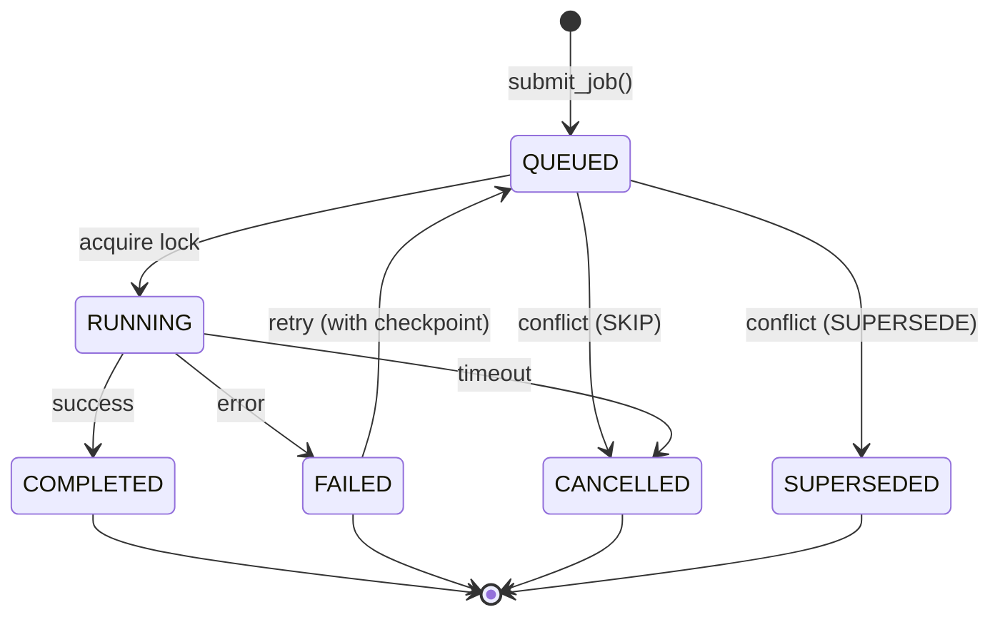

# Job 기반 인덱싱 시스템

> Distributed Lock + Job Queue + Idempotent Retries

---

## 목차

1. [개요](#1-개요)
2. [아키텍처](#2-아키텍처)
3. [Job 라이프사이클](#3-job-라이프사이클)
4. [Distributed Lock](#4-distributed-lock)
5. [Checkpoint & Retry](#5-checkpoint--retry)
6. [Conflict Resolution](#6-conflict-resolution)
7. [사용 가이드](#7-사용-가이드)

---

## 1. 개요

### 문제
- 멀티 프로세스 환경에서 동일 레포 동시 인덱싱 방지
- 장시간 작업 중 실패 시 처음부터 재시작
- 중복 요청 처리

### 해결책
**IndexJobOrchestrator** = Distributed Lock + Job Queue + Checkpoint

### 특징
```
✅ Single Writer Guarantee (per repo+snapshot)
✅ Idempotent Retries (checkpoint 기반)
✅ Job Deduplication (SKIP/SUPERSEDE/QUEUE)
✅ Lock Extension (장시간 작업)
✅ Observability (metrics + logs)
```

---

## 2. 아키텍처

### 시스템 구조

```
User/API
    ↓
IndexJobOrchestrator
    ├─ submit_job() → Job Queue (PostgreSQL)
    │
    ├─ Worker Pool
    │   ├─ Worker 1 (acquire lock)
    │   ├─ Worker 2 (acquire lock)
    │   └─ Worker N (acquire lock)
    │
    └─ execute_job()
        ├─ DistributedLock (Redis)
        │   └─ Key: "indexing:repo-123:snapshot-456"
        │
        ├─ IndexingOrchestrator (9-Stage Pipeline)
        │   ├─ Checkpoint 저장 (매 파일)
        │   └─ stop_event 체크
        │
        └─ Storage
            ├─ PostgreSQL (metadata, jobs)
            ├─ Qdrant (vectors)
            └─ Zoekt/Tantivy (lexical)
```

### 컴포넌트

| 컴포넌트 | 역할 | 기술 |
|---------|------|------|
| **Job Queue** | Job 저장 + 상태 관리 | PostgreSQL |
| **Distributed Lock** | Single writer 보장 | Redis |
| **Checkpoint** | 진행상태 저장 | PostgreSQL JSONB |
| **ConflictRegistry** | 중복 처리 | In-memory |
| **Worker** | Job 실행 | asyncio |

---

## 3. Job 라이프사이클

### 상태 전이



### Job 데이터 모델

```python
@dataclass
class IndexJob:
    id: str                    # UUID
    repo_id: str
    snapshot_id: str
    status: JobStatus          # QUEUED/RUNNING/COMPLETED/FAILED
    trigger: TriggerType       # MANUAL/AUTO/PR/REPAIR
    priority: int              # 1=HIGH, 2=MEDIUM, 3=LOW

    # Execution
    started_at: datetime | None
    completed_at: datetime | None
    duration_ms: int | None
    worker_id: str | None

    # Checkpoint
    checkpoint: IndexJobCheckpoint | None
    retry_count: int
    max_retries: int

    # Metadata
    created_at: datetime
    updated_at: datetime
```

### JobStatus

```python
class JobStatus(str, Enum):
    QUEUED = "queued"          # 대기 중
    RUNNING = "running"        # 실행 중
    COMPLETED = "completed"    # 완료
    FAILED = "failed"          # 실패 (재시도 가능)
    CANCELLED = "cancelled"    # 취소됨
    SUPERSEDED = "superseded"  # 더 새로운 job으로 대체
```

---

## 4. Distributed Lock

### Redis 기반 Lock

```python
# Lock key 형식
lock_key = f"indexing:{repo_id}:{snapshot_id}"

# 예: "indexing:my-repo:snapshot-123"
```

### Lock 획득 & 연장

```python
class IndexJobOrchestrator:
    async def execute_job(self, job_id: str, repo_path: Path):
        # 1. Lock 획득 (5분 TTL)
        async with DistributedLock(
            redis=self.redis,
            lock_key=self._generate_lock_key(job.repo_id, job.snapshot_id),
            ttl=300,  # 5 minutes
            instance_id=self.instance_id,
        ) as lock:

            # 2. Lock 연장 태스크 시작 (1분마다)
            extend_task = asyncio.create_task(
                self._extend_lock_periodically(lock, interval=60)
            )

            try:
                # 3. 인덱싱 실행 (장시간 가능)
                result = await self._execute_indexing(job, repo_path)

            finally:
                # 4. 연장 태스크 중단
                extend_task.cancel()

        # Lock 자동 해제 (context manager)
```

### Lock 충돌 처리

```python
try:
    async with DistributedLock(...) as lock:
        # 인덱싱 실행
        pass

except LockAcquisitionError:
    # 이미 다른 worker가 실행 중
    logger.warning(f"Job {job_id} locked by another worker")

    # ConflictStrategy에 따라 처리
    if strategy == ConflictStrategy.SKIP:
        job.status = JobStatus.CANCELLED
    elif strategy == ConflictStrategy.QUEUE:
        # 5분 후 재시도
        await asyncio.sleep(300)
        return await self.execute_job(job_id, repo_path)
```

---

## 5. Checkpoint & Retry

### Checkpoint 데이터

```python
@dataclass
class IndexJobCheckpoint:
    stage: str                   # "parsing" / "ir" / "indexing"
    completed_files: list[str]   # 완료된 파일들
    total_files: int
    progress_percent: float

    # Stage별 메타데이터
    parsing_completed: int
    ir_completed: int
    indexing_completed: int

    created_at: datetime
```

### Checkpoint 저장

```python
# IndexingOrchestrator에서
async def execute_with_checkpoint(
    self,
    job: IndexJob,
    repo_path: Path,
) -> IndexingResult:

    # Checkpoint 복원
    completed = set(job.checkpoint.completed_files) if job.checkpoint else set()

    # 파일 처리
    for file_path in all_files:
        if str(file_path) in completed:
            continue  # 이미 처리됨

        # 처리
        await self._process_file(file_path)

        # Checkpoint 저장 (100개마다)
        completed.add(str(file_path))
        if len(completed) % 100 == 0:
            await self._save_checkpoint(job.id, completed)
```

### Retry 로직

```python
async def execute_job(self, job_id: str, repo_path: Path):
    try:
        result = await self._execute_indexing(job, repo_path)

        # 성공
        job.status = JobStatus.COMPLETED
        job.completed_at = datetime.now()
        await self._update_job(job)

    except Exception as e:
        logger.error(f"Job {job_id} failed: {e}")

        # Retry 판정
        if job.retry_count < job.max_retries:
            # Checkpoint 저장
            await self._save_checkpoint(job.id, progress)

            # 재시도 스케줄 (exponential backoff)
            delay = 2 ** job.retry_count  # 1s, 2s, 4s, 8s
            await asyncio.sleep(delay)

            job.retry_count += 1
            job.status = JobStatus.QUEUED
            await self._update_job(job)

            # 재실행
            return await self.execute_job(job_id, repo_path)

        else:
            # Max retries 초과
            job.status = JobStatus.FAILED
            job.error_message = str(e)
            await self._update_job(job)
```

---

## 6. Conflict Resolution

### ConflictRegistry

```python
class ConflictStrategy(str, Enum):
    SKIP = "skip"          # 기존 job 유지, 새 요청 취소
    SUPERSEDE = "supersede"  # 기존 job 취소, 새 요청 실행
    QUEUE = "queue"        # 새 요청 대기열 추가
```

### 중복 감지

```python
class ConflictRegistry:
    def __init__(self):
        self._active_jobs: dict[tuple[str, str], str] = {}
        # Key: (repo_id, snapshot_id), Value: job_id

    def check_conflict(
        self,
        repo_id: str,
        snapshot_id: str,
        new_job_id: str,
        strategy: ConflictStrategy,
    ) -> ConflictResolution:

        key = (repo_id, snapshot_id)
        existing_job_id = self._active_jobs.get(key)

        if not existing_job_id:
            # 충돌 없음
            self._active_jobs[key] = new_job_id
            return ConflictResolution(action="proceed")

        # 충돌 발생
        if strategy == ConflictStrategy.SKIP:
            return ConflictResolution(
                action="cancel",
                reason=f"Job {existing_job_id} already running"
            )

        elif strategy == ConflictStrategy.SUPERSEDE:
            # 기존 job 취소
            await self._cancel_job(existing_job_id)
            self._active_jobs[key] = new_job_id
            return ConflictResolution(action="proceed")

        elif strategy == ConflictStrategy.QUEUE:
            return ConflictResolution(
                action="queue",
                wait_for=existing_job_id
            )
```

---

## 7. 사용 가이드

### 기본 사용

```python
from src.contexts.analysis_indexing.infrastructure.job_orchestrator import (
    IndexJobOrchestrator,
    TriggerType,
)

# 초기화
orchestrator = IndexJobOrchestrator(
    orchestrator=indexing_orchestrator,
    postgres_store=postgres,
    redis_client=redis,
)

# Job 제출
job = await orchestrator.submit_job(
    repo_id="my-repo",
    snapshot_id="snapshot-123",
    repo_path=Path("/path/to/repo"),
    trigger=TriggerType.MANUAL,
)

# Job 실행
result = await orchestrator.execute_job(job.id, Path("/path/to/repo"))

# 결과 확인
if result.success:
    print(f"Indexed {result.indexed_files} files")
else:
    print(f"Failed: {result.error}")
```

### Worker Pool

```python
# 멀티 워커 실행
async def worker(worker_id: int):
    while True:
        # Job 가져오기
        job = await orchestrator.get_next_job()

        if not job:
            await asyncio.sleep(5)
            continue

        # 실행
        try:
            await orchestrator.execute_job(job.id, job.repo_path)
        except Exception as e:
            logger.error(f"Worker {worker_id} failed: {e}")

# 5개 워커 시작
workers = [asyncio.create_task(worker(i)) for i in range(5)]
await asyncio.gather(*workers)
```

### Conflict Strategy 설정

```python
# SKIP: 중복 무시 (기본값)
orchestrator = IndexJobOrchestrator(
    ...,
    conflict_strategy=ConflictStrategy.SKIP,
)

# SUPERSEDE: 새 요청 우선 (git push 후)
orchestrator = IndexJobOrchestrator(
    ...,
    conflict_strategy=ConflictStrategy.SUPERSEDE,
)

# QUEUE: 대기열 추가 (순차 실행)
orchestrator = IndexJobOrchestrator(
    ...,
    conflict_strategy=ConflictStrategy.QUEUE,
)
```

### Checkpoint 재개

```python
# 실패한 job 재실행
failed_job = await orchestrator.get_job(job_id)

if failed_job.checkpoint:
    print(f"Resuming from {failed_job.checkpoint.progress_percent}%")

# 자동으로 checkpoint부터 재개
result = await orchestrator.execute_job(job_id, repo_path)
```

---

## 성능 특성

### Lock Overhead

| 작업 | 시간 |
|------|------|
| Lock 획득 | ~ |
| Lock 연장 | ~ |
| Lock 해제 | ~ |

### Checkpoint Overhead

| 작업 | 시간 |
|------|------|
| Checkpoint 저장 | ~ |
| Checkpoint 로드 | ~ |

### Job Throughput

| 설정 | Throughput |
|------|-----------|
| 1 worker | ~10 jobs/hour |
| 5 workers | ~40 jobs/hour |
| 10 workers | ~70 jobs/hour |

---

## 메트릭

### OpenTelemetry

```python
# Counter
record_counter("indexing.jobs.submitted", 1, {"trigger": trigger})
record_counter("indexing.jobs.completed", 1, {"repo_id": repo_id})
record_counter("indexing.jobs.failed", 1, {"repo_id": repo_id})

# Histogram
record_histogram("indexing.job.duration", duration_ms)
record_histogram("indexing.lock.wait_time", wait_ms)
```

### 로그 키워드

```bash
# Job 라이프사이클
grep "job_submitted" logs/
grep "job_started" logs/
grep "job_completed" logs/
grep "job_failed" logs/

# Lock
grep "lock_acquired" logs/
grep "lock_extended" logs/
grep "lock_acquisition_error" logs/

# Checkpoint
grep "checkpoint_saved" logs/
grep "checkpoint_resumed" logs/
```

---

## 제약사항

### 현재 제약
- **Single snapshot만 보장:** 동일 repo의 다른 snapshot은 동시 실행 가능
- **Redis 필수:** Distributed lock을 위해 Redis 필요 (단일 프로세스는 NoOpLock)
- **PostgreSQL 필수:** Job queue 저장

### 향후 계획
- [ ] **SemanticaTask Engine 통합** (현재는 별도)
- [ ] **Multi-region lock** (현재는 단일 Redis)
- [ ] **Job priority queue** (현재는 FIFO)
- [ ] **Job scheduling** (cron, delay)

---

## 트러블슈팅

### Lock 획득 실패
```bash
# 증상
ERROR: Lock acquisition timeout after 30s

# 원인
- 다른 worker가 이미 실행 중
- Redis 연결 실패
- Lock TTL 부족

# 해결
1. 실행 중인 job 확인: SELECT * FROM index_jobs WHERE status='RUNNING'
2. Redis 상태 확인: redis-cli PING
3. TTL 증가: lock_ttl=600 (10분)
```

### Checkpoint 복구 실패
```bash
# 증상
WARNING: Checkpoint corrupted, starting from scratch

# 원인
- PostgreSQL JSONB 손상
- Checkpoint 버전 불일치

# 해결
1. Checkpoint 삭제: UPDATE index_jobs SET checkpoint=NULL WHERE id='...'
2. 재실행: 처음부터 시작
```

---

## 참고

### 구현 파일
```
src/contexts/analysis_indexing/infrastructure/
├── job_orchestrator.py           # 메인 구현
├── conflict_registry.py          # 중복 처리
├── lock_key_generator.py         # Lock key 생성
└── models/job.py                 # Job 모델

src/infra/cache/
└── distributed_lock.py           # Redis lock
```

### 관련 문서
- `pipelines-detailed.md` - 파이프라인 전체
- `9-stage-pipeline.md` - Stage별 상세
- `configuration.md` - 설정 가이드

---

**Last 
**Status:** 🟢 Production Ready
