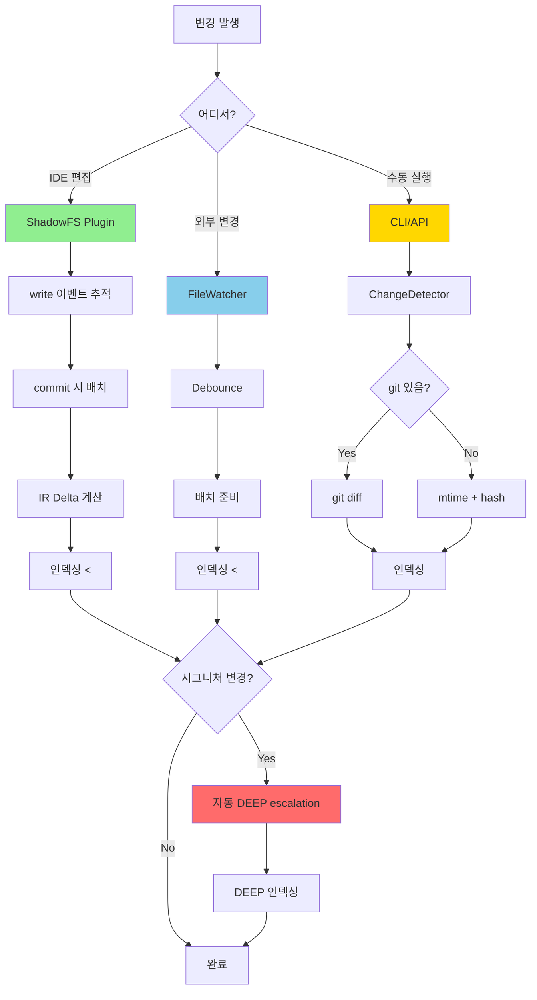
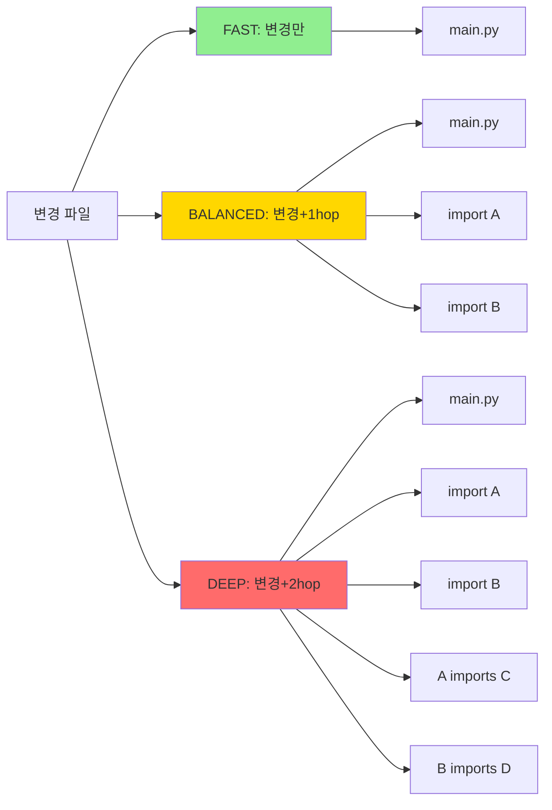
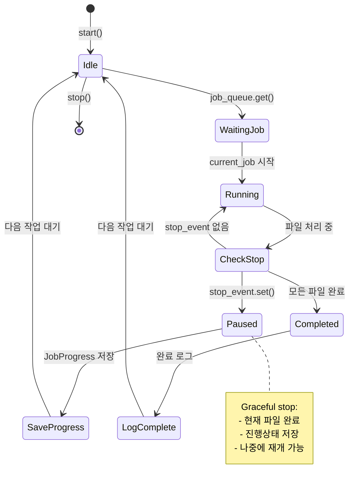
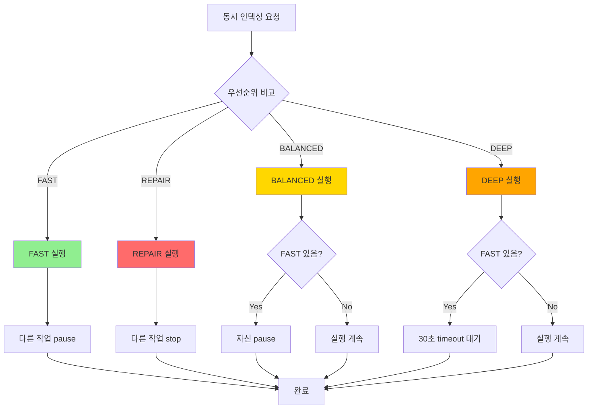
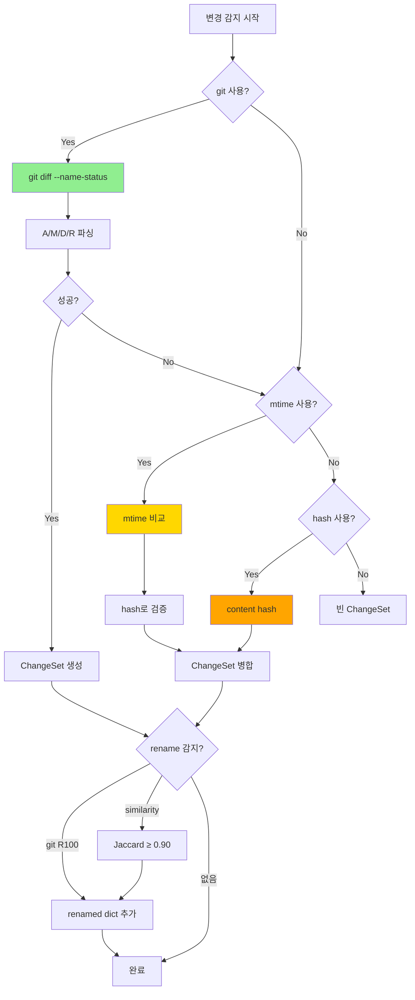
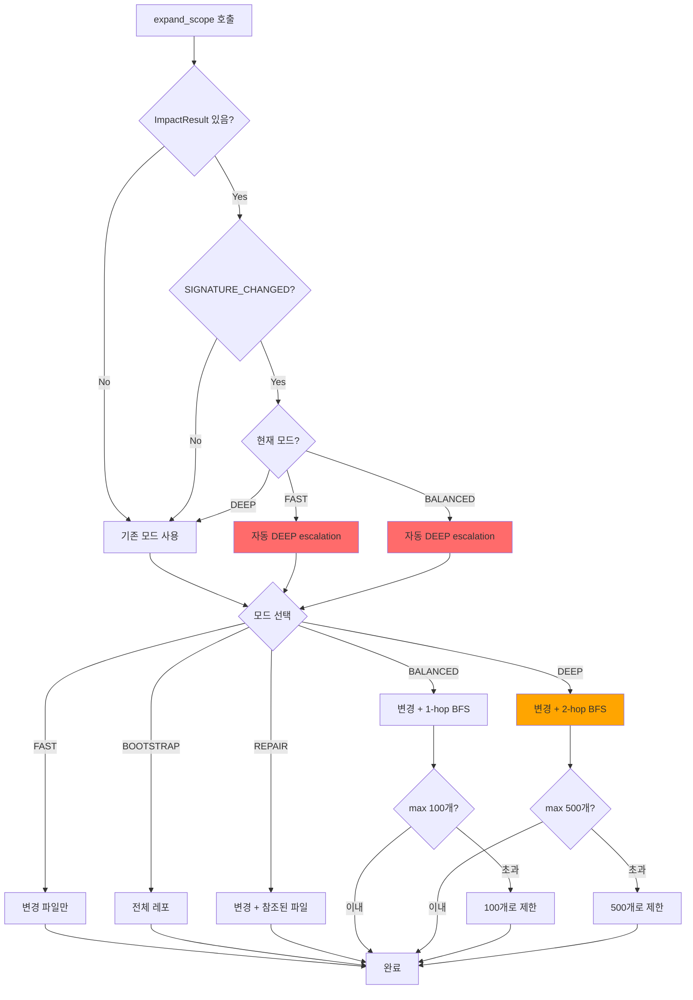
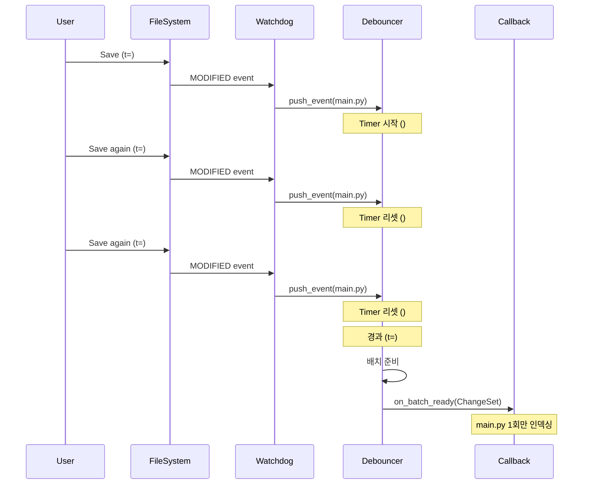
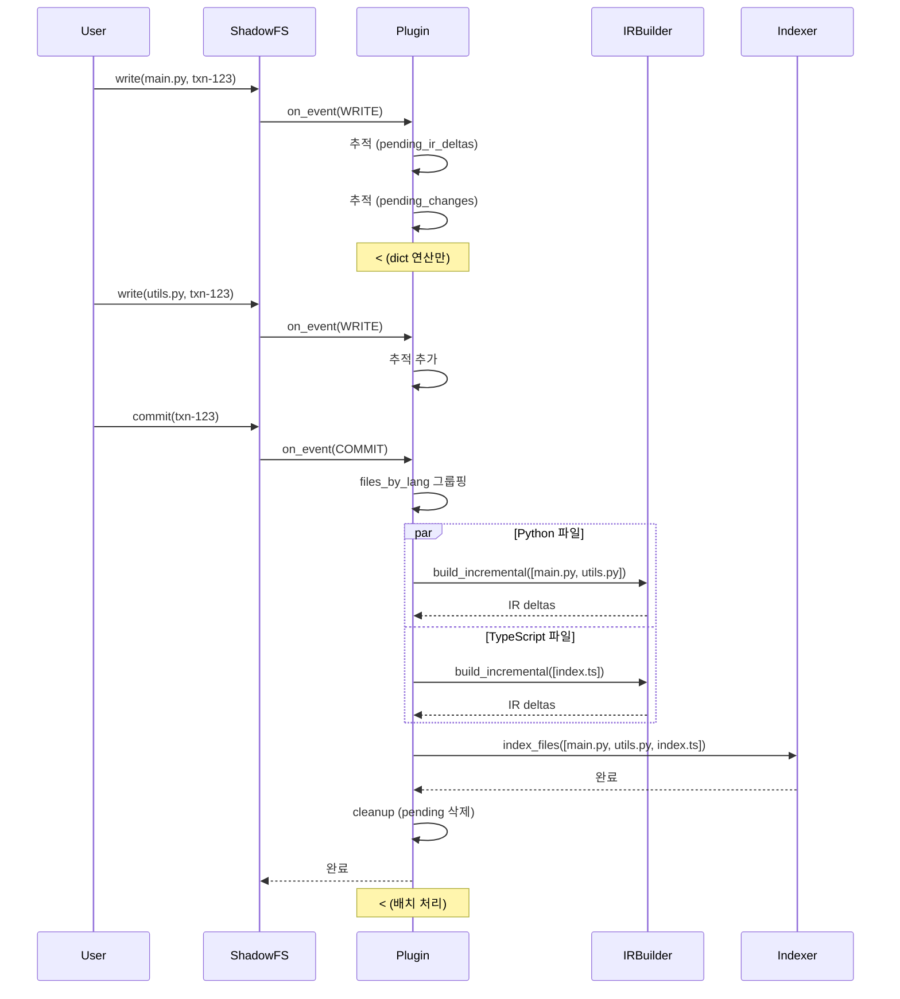
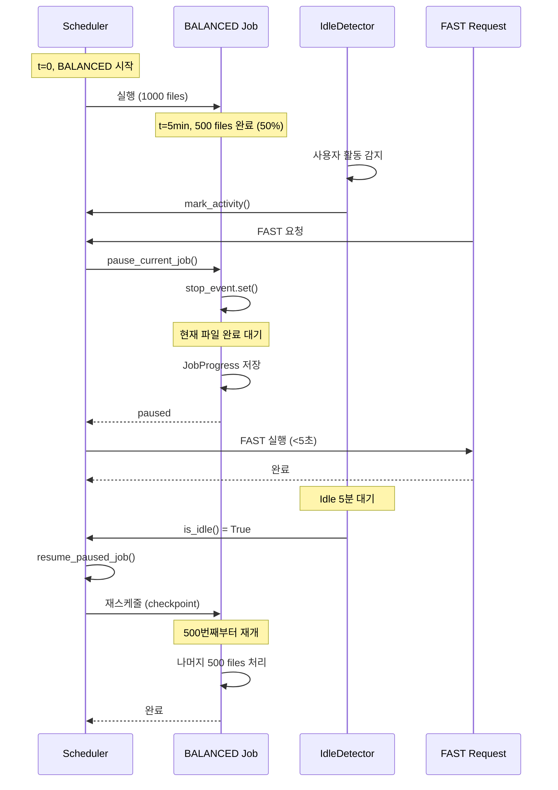
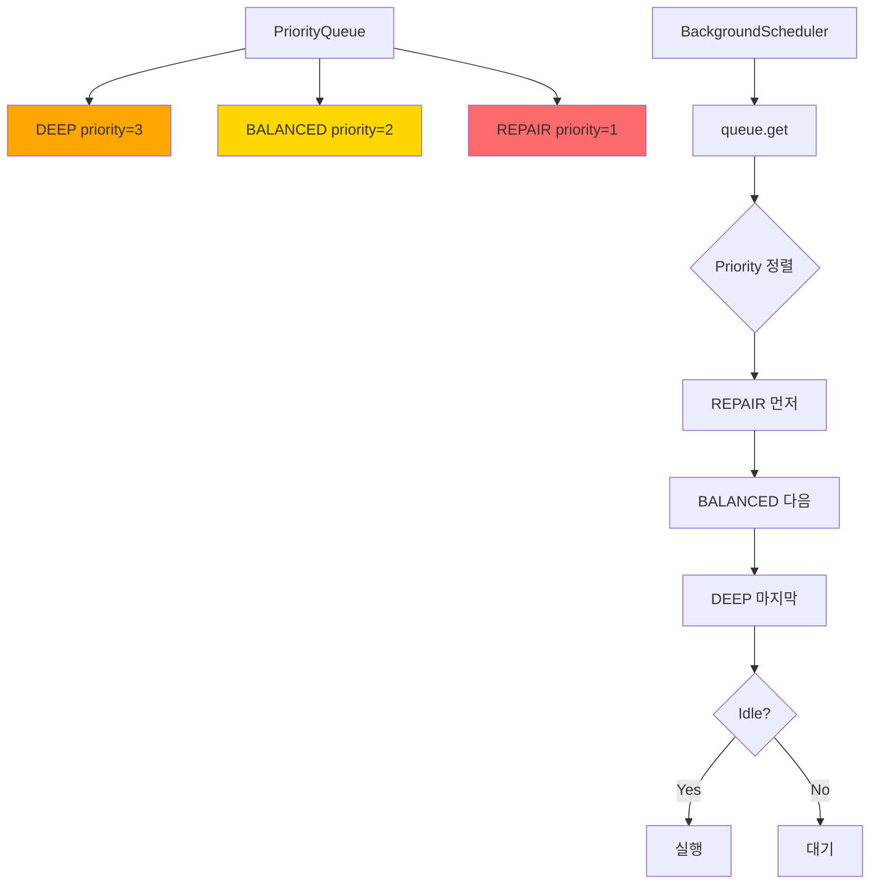

# 인덱싱 파이프라인 시각화 다이어그램

> Mermaid 다이어그램 모음

---

## 1. 전체 파이프라인 플로우

---

## 2. 모드별 처리 범위

---

## 3. BackgroundScheduler 상태 머신

---

## 4. 충돌 해결 우선순위

---

## 5. ChangeDetector 전략

---

## 6. ScopeExpander 자동 Escalation

---

## 7. FileWatcher Debouncing

---

## 8. ShadowFS Plugin 라이프사이클

---

## 9. 엣지케이스: BALANCED Pause & Resume

---

## 10. 우선순위 큐 동작

---

## 사용 방법

### Mermaid Live Editor
1. https://mermaid.live 방문
2. 위 코드 복사/붙여넣기
3. PNG/SVG 다운로드

### VS Code
1. Mermaid Preview 확장 설치
2. Cmd+Shift+P → "Mermaid: Preview"

### Notion/Confluence
- Mermaid 블록 생성 후 코드 붙여넣기

---

**Last 
