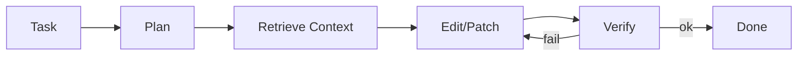

# agent (LLM Orchestration / Tools)

**
**Scope:** LLM agent가 시스템의 각 계층(검색/그래프/검증/패치)을 호출하는 실행 구조  
**Source of Truth:** `src/agent/`

---

## What it does

- 작업을 plan → execute → verify 루프로 수행
- MCP/내부 도구를 통해 graph/context/verify를 호출

---

## Inputs / Outputs

- **Input**: user task + repo context
- **Output**: patches + verification results (+ optional artifacts)

---

## Diagram

---

## Links

- MCP 프로토콜(현재): `_docs/system-handbook/design/mcp-sota-protocol.md`

