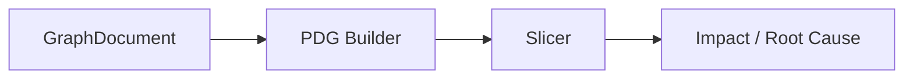

# reasoning_engine (PDG / Slicer / Impact / VFG)

**
**Scope:** 그래프 기반 추론/슬라이싱/영향분석 등 고급 분석 계층  
**Source of Truth:** `src/contexts/reasoning_engine/`

---

## What it does

- PDG(의존성 그래프) 기반 슬라이싱
- 영향 분석/근본 원인 탐색을 위한 그래프 연산

---

## Inputs / Outputs

- **Input**: `GraphDocument` + anchor(symbol/node) + direction/constraints
- **Output**: slice/subgraph + 증명(경로/엣지) 정보

---

## Diagram

