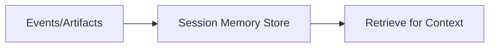

# session_memory (Episodic / Semantic)

**
**Scope:** 세션 기반 메모리(에피소드/세만틱) 저장/조회 계층  
**Source of Truth:** `src/contexts/session_memory/`

---

## What it does

- 작업/대화/실행 컨텍스트를 세션 단위로 저장
- 검색/추론 단계에서 필요한 과거 근거를 재주입

---

## Inputs / Outputs

- **Input**: events/artifacts (snapshot, findings, decisions)
- **Output**: retrieved memory items (for context building)

---

## Diagram

